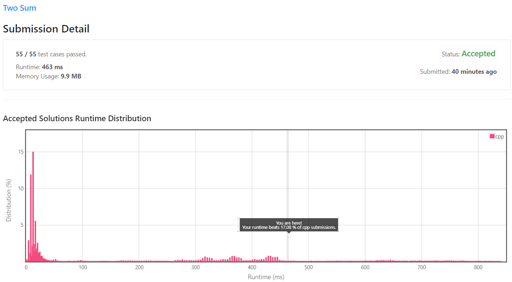
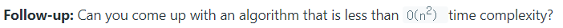
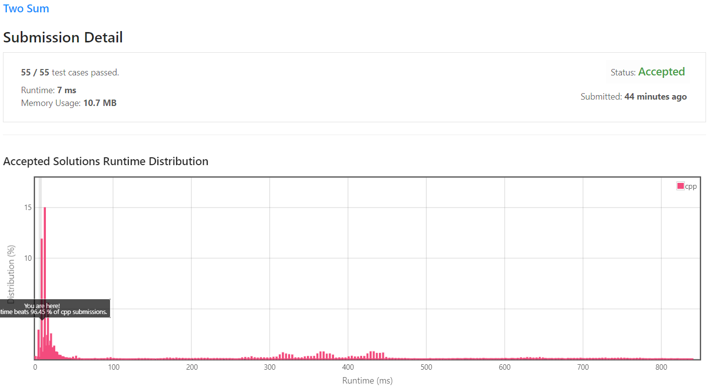

[[[
title : [C++ LeetCode - 1. Two Sum]
date : 2021-10-24 22:10:27
series : "LeetCode"
tags : ["Leet Code", "easy", "c++"]
]]]

## LeetCode - 1. Two Sum
문제 - [LeetCode 1. Two Sun](https://leetcode.com/problems/two-sum/)

## 문제 설명
LeetCode의 1번 문제인 Two Sum은 정수형 배열과 target 숫자를 입력받습니다. 그리고 정수형 배열 내 숫자들을 이용해 target 숫자를 만들 수 있는 숫자 2개를 찾아 index를 반환하는 문제입니다.

답은 **정확히 하나만** 존재하며 같은 원소는 사용하지 않습니다.

난이도는 `EASY` 난이도 입니다.

## 풀이
### Solution 1 - Brute force
첫 번째로 떠올린 방법은 Brute force, 무차별 대입 방법입니다. 단순히 배열을 모두 순회하면서 두 숫자를 더했을 때 target 숫자와 동일한 index 두 개를 찾는 방법입니다.

```c++
for (int x = 0 ; x < nums.size() ; x++)
{
    for (int y = x + 1 ; y < nums.size() ; y++)
    {
        int sumResult = nums[x] + nums[y];

        if (target == sumResult)
        {
            return std::vector<int>{x, y};
        }
    }

    return std::vector<int>();
}
```

정말 심플합니다. 단순히 이중 반복문을 이용하여 배열을 순회하면서 하나하나 덧셈하여 target과 동일한 결과의 index를 반환합니다.

다만 특별한점이라면 내부의 중첩된 반복문은 `x + 1`번째부터 시작하는데, 이는 문제에 적혀있던 같은 원소를 사용하지 않기 때문이며 그리고 숫자를 더할 때 `x + y`나 `y + x`의 결과는 동일하기 때문에 중복된 case를 수행하지 않게 하기 위함입니다.

#### 제출 결과

실행 시간은 `463ms` 메모리는 `9.9MB`사용하였다. 테스트 케이스가 55개밖에 안되는데 사실상 0.5초가량 걸렸다.

O(n^2)의 코드이기 때문에 그닥 빠른 알고리즘은 아니다.

<details>
    <summery>▼ 코드 전문</summery>
    <p>
    ```c++
    #include <iostream>
    #include <vector>
    #include <string>
    #include <tuple>

    class Solution
    {
    public:
        std::vector<int> Answer(std::vector<int>& nums, int target)
        {
            for (int x = 0 ; x < nums.size() ; x++)
            {
                for (int y = x + 1 ; y < nums.size() ; y++)
                {
                    int sumResult = nums[x] + nums[y];

                    if (target == sumResult)
                    {
                        return std::vector<int>{x, y};
                    }
                }
            }

            return std::vector<int>();
        }
    };


    int main(void)
    {
        Solution sol;

        std::vector<std::tuple<std::vector<int>, int>> problems {
            std::make_tuple(std::vector<int>{2, 7, 11, 15}, 9),
            std::make_tuple(std::vector<int>{3, 2 ,4}, 6),
            std::make_tuple(std::vector<int>{3, 3}, 6)
        };

        for (auto problem : problems)
        {
            auto answer = sol.Answer(std::get<0>(problem), std::get<1>(problem));

            for (int num : answer)
            {
                std::cout << num << " ";
            }
            std::cout << std::endl;
        }

    }
    ```
    </p>
</details>

### Solution 2 - hash table

첫 번째 해결책은 O(n^2)의 코드이다. 이보다 더 빠른 해결책을 제시해보자.

첫 번째 방법의 문제점은 중첩된 반복문의 사용이며, 하나의 x를 정해 target에 맞는 y를 계속 찾는 방법이다. 즉, 반복문이 돌며 x가 바뀌면 이전에 계산했던 모든 `x + y`의 계산 결과는 없어지며 새로운 x를 정해 다시 y를 찾아가는 여행을 떠나야하는 것이다.

여기서 생각을 바꾸어 이전에 나왔던 x를 별도의 메모리에 저장하여 `diff = target - x`를 수행하여 `diff`에 해당 하는 값이 이전에 나왔다면 `diff + x = target`이 되므로 결국 diff와 x의 index를 반환하면 된다. 이렇게 되면 순회가 단 한번만 발생하니 O(n)이 된다.

그런데 여기서 또 발생하는 문제점은 x를 메모리에 저장한 후에 diff와 동일한 값을 찾을 때 배열을 순회해야 한다. 만약 1차원 배열이라면 O(n)의 순회 시간이 발생할 것이다. 즉, 결국 O(n^2)랑 차이가 없게 된다.

이를 해결하기 위해 일반 배열이 아닌 Hash Table을 사용한다. Hash table은 Hash 함수를 key를 hash화 하여 저장할 index를 계산해 저장하는 방식이기 때문에 탐색과 삽입이 O(1)이 된다. 

```c++
//                num, index
std::unordered_map<int, int> table;

for (int x = 0 ; x < nums.size() ; x++)
{
    int diff = target - nums[x];

    auto search = table.find(diff);
    if (search != table.end())
    {
        return std::vector<int>{x, search->second};
    }

    table.insert(std::make_pair(nums[x], x));
}

return std::vector<int>();
```

C++의 [unordered_map](https://en.cppreference.com/w/cpp/container/unordered_map)은 key-value형태의 컨테이너이며 상수 시간내에 삽입, 삭제, 탐색, 비교가 이루어지는 자료구조 즉, Hash table이다.

먼저 `diff = target - nums[x]`를 통해 target에 x를 빼면 남는 값 diff가 이미 등장한 적이 있는지 확인한다.
만약 있다면 등장했었던 그 값의 index와 현재 x의 index를 반환하면 끝이다.

매우 간단하지만, 기존의 O(n^2) 코드에 비교하면 O(n)이므로 속도 향상이 매우 많이 이루어졌을 것이라고 생각된다.

#### 제출 결과


기존의 약 `500ms`의 속도에서 `7ms`의 속도로 70배 가까이 향상된 속도를 보여준다. 다만 별도의 저장 공간을 사용했기에 메모리의 크기가 `9.9MB`에서 `10.7MB`로 증가했다.

<details>
    <summery>▼ 코드 전문</summery>
    <p>
    ```c++
    #include <iostream>
    #include <vector>
    #include <string>
    #include <tuple>
    #include <unordered_map>

    class Solution
    {
    public:
        std::vector<int> Answer(std::vector<int>& nums, int target)
        {
            //                num, index
            std::unordered_map<int, int> table;

            for (int x = 0 ; x < nums.size() ; x++)
            {
                int diff = target - nums[x];

                auto search = table.find(diff);
                if (search != table.end())
                {
                    return std::vector<int>{x, search->second};
                }

                table.insert(std::make_pair(nums[x], x));
            }

            return std::vector<int>();
        }
    };


    int main(void)
    {
        Solution sol;

        std::vector<std::tuple<std::vector<int>, int>> problems {
            std::make_tuple(std::vector<int>{2, 7, 11, 15}, 9),
            std::make_tuple(std::vector<int>{3, 2 ,4}, 6),
            std::make_tuple(std::vector<int>{3, 3}, 6)
        };

        for (auto problem : problems)
        {
            auto answer = sol.Answer(std::get<0>(problem), std::get<1>(problem));

            for (int num : answer)
            {
                std::cout << num << " ";
            }
            std::cout << std::endl;
        }

    }
    ```
    </p>
</details>