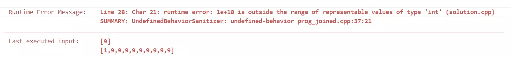

[[[
title : LeetCode - 2. Add Two Numbers
date : 2021-10-26 22:21:00
series : "LeetCode"
tags : ["Leet Code", "medium", "c++"]
]]]

## LeetCode - 2. Add Two Numbers
문제 - [LeetCode 2. Add Two Numbers](https://leetcode.com/problems/add-two-numbers/)

## 문제 설명
두 개의 LinkedList가 주어지며, LinkedList는 음수가 아닌 한 자리의 숫자를 저장하는 Node들을 가지며, 해당 숫자들의 역순으로 음수가 아닌 하나의 정수를 표현합니다.


위 예시의 경우 `2->4->3`으로 저장되는 LinkedList는 `342`라는 숫자를 표현합니다.

동일하게 밑에 있는 `5->6->4`는 `465`라는 숫자를 표현하게 됩니다. 이때 두 수를 더하여 807이라는 값을 계산한 후 이를 `7->0->8`로 표현되는 LinkedList로 반환하면 됩니다.

난이도는 `MEDIUM` 난이도 입니다.

## 풀이
### Solution

첫 번째 생각했던 방법은 두 LinkedList에 저장된 숫자들을 각각 완성된 정수값으로 변환하여 덧셈 후 다시 LinkedList 형태로 변환하는 방법입니다.

```c++
int multiplier = 0;
int numOfl1 = 0;
int numOfl2 = 0;

for (ListNode* node = l1; node != nullptr ; node = node->next)
{
    numOfl1 += node->val * powl(10, multiplier);
    multiplier++;
}

multiplier = 0;

for (ListNode* node = l2; node != nullptr ; node = node->next)
{
    numOfl2 += node->val * powl(10, multiplier);
    multiplier++;
}

int add = numOfl1 + numOfl2;

ListNode* head = new ListNode(add % 10);
ListNode* result = head;
for (int num = add/10; num > 0 ; num /= 10 )
{
    int digit = num % 10;

    ListNode* node = new ListNode(digit);
    result->next = node;

    result = node;
}

return head;
```

각각 완성된 정수로 변환 후 덧셈하여 다시 LinkedList로 변환하는 방법이지만, 큰 문제가 하나 발생하하였습니다.



코드의 실행 결과 int형의 범위를 넘는 값이 입력된 경우 overflow가 발생해 음수가 되며 Runtime Error가 발생하였습니다.

이를 해결하기 위해 두 번째 방법을 사용하였습니다.

```c++
int carry = 0;

ListNode* node1 = l1;
ListNode* node2 = l2;

ListNode* head = nullptr;
ListNode* lastNode = nullptr;

while (node1 != nullptr || node2 != nullptr)
{
    int numOf1 = node1 ? node1->val : 0;
    int numOf2 = node2 ? node2->val : 0;

    int sum = numOf1 + numOf2 + carry;

    carry = sum / 10;

    ListNode* newNode = new ListNode(sum % 10);

    if (!head) head = newNode;
    else lastNode->next = newNode;

    lastNode = newNode;

    if(node1) node1 = node1->next;
    if(node2) node2 = node2->next;
}

if (carry > 0)
{
    ListNode* node = new ListNode(carry);
    lastNode->next = node;
}
```

int 타입 대신 long, long long과 같은 64bit 타입을 쓴다면 당장의 문제는 해결될지 모르지만, 만약 더 큰 수가 들어온다면 동일한 에러가 발생할 것이 분명합니다.

생각을 바꾸어 완성된 정수 값으로 변환하고 더하는 것이 아닌, 한 자리씩 더하여 Node를 생성하고 LinkedList를 형성하면 됩니다.

여기서 추가로 신경써주어야 할 부분은 한 자리씩 더한 후에 발생하는 올림(carry)의 경우만 따로 저장해서 다음 자리 수를 더할 때 추가로 더해주면 됩니다.

<details>
<summary>코드 전문</summary>
    
```c++
class Solution {
public:
    ListNode* addTwoNumbers(ListNode* l1, ListNode* l2) 
    {
        int carry = 0;

        ListNode* node1 = l1;
        ListNode* node2 = l2;

        ListNode* head = nullptr;
        ListNode* lastNode = nullptr;

        while (node1 != nullptr || node2 != nullptr)
        {
            int numOf1 = node1 ? node1->val : 0;
            int numOf2 = node2 ? node2->val : 0;

            int sum = numOf1 + numOf2 + carry;

            carry = sum / 10;

            ListNode* newNode = new ListNode(sum % 10);

            if (!head) head = newNode;
            else lastNode->next = newNode;

            lastNode = newNode;

            if(node1) node1 = node1->next;
            if(node2) node2 = node2->next;
        }

        if (carry > 0)
        {
            ListNode* node = new ListNode(carry);
            lastNode->next = node;
        }
    
        return head;
    }
};
```

</details>

#### 제출 결과


실행 시간은 28ms, 메모리 사용량은 71.4MB로 측정되었습니다. 

다른 C++ 제출자보다 80% 좋은 속도를 보여주었다고 되어있는데, 더 빠른 속도의 코드를 확인해보니 거의 다 비슷비슷 한 것 같습니다. 정말 특별하게 최적화를 한 것이 아닌 이상 이정도가 평균일 것 같습니다.