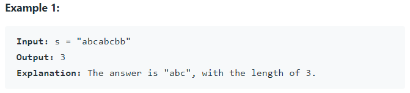
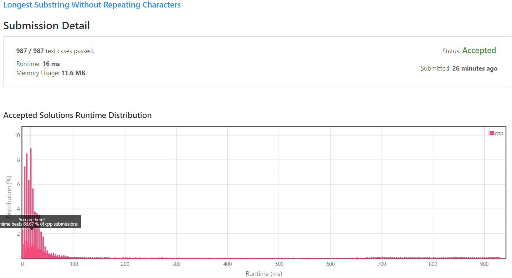
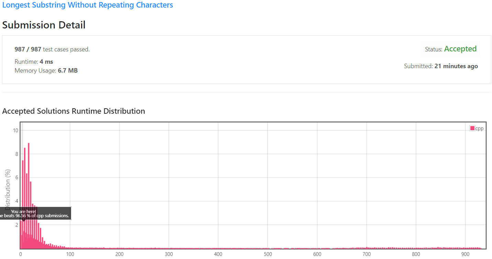

[[[
title : LeetCode - 3. Longest Substring Without Repeating Characters
date : 2021-10-27 21:47:50
series : "LeetCode"
tags : ["Leet Code", "medium", "c++"]
]]]

## LeetCode - 3. Longest Substring Without Repeating Characters
문제 - [LeetCode 3. Longest Substring Without Repeating Characters](https://leetcode.com/problems/longest-substring-without-repeating-characters/)

## 문제 설명
특정 문자열 `s`가 주어질 때 똑같은 문자를 반복하지 않는, 가장 긴 부분 문자열을 구하는 문제입니다.



만약 입력 문자열이 `s = "abcabcbb"`라면 반복하는 bb를 제외하고, 반복하지 않는 문자열인 "abc"의 길이인 3이 구해집니다.

즉, 부분 문자열에서 동일한 문자가 없는, 가장 긴 길이의 부분 문자열을 구합니다.

난이도는 `MEDIUM` 난이도 입니다.

## 풀이
### Solution 1 - Brute force
첫 번째 시도는 무차별 대입을 통한 검사를 진행합니다.

만약 s 문자열의 길이가 n이라면 i가 0->n 일때 i ~ n사이의 부분 문자열을 계속 찾습니다.

```c++
int lengthOfLongestSubstring(std::string s) 
{
    int longestLength = 0;

    for (int i = 0 ; i < s.size() ; i++)
    {
        int length = 0;
        int sliceStart = i;

        for (int j = i ; j < s.size() ; j++)
        {
            std::string substr = s.substr(sliceStart, length);
            int pos = substr.find_first_of(s.at(j));

            if (pos == std::string::npos)
            {
                // Not found
                length++;

                longestLength = (longestLength < length) ? length : longestLength;
            }
            else
            {
                break;
            }
        }

        if (s.size() - i < longestLength) break;
    }

    return longestLength;
}
```

중첩된 반복문을 이용해 모든 경우의 수를 탐색합니다.

문자열을 찾는 주요 부분은 내부 반복문이니 내부 반복문만 따로 빼서 확인해보겠습니다.

```c++
for (int j = i ; j < s.size() ; j++)
{
    std::string substr = s.substr(sliceStart, length);
    int pos = substr.find_first_of(s.at(j));

    if (pos == std::string::npos)
    {
        // Not found
        length++;

        longestLength = (longestLength < length) ? length : longestLength;
    }
    else
    {
        break;
    }
}
```

j는 i -> n까지 증가합니다. 문자열 s를 i부터 length 길이만큼 잘라 부분 문자열을 생성합니다. 문자열 s의 j번째 문자를 가져와 현재 부분 문자열에 동일한 문자가 있는지 검사합니다.

만약 현재 추출한 부분 문자열에 동일한 문자(중복되는 문자)가 없다면 부분 문자열의 길이를 1 증가합니다.

중복된 문자열이 존재하다면 반복문을 탈출합니다.

위 반복문을 s문자열의 길이 n번만큼 반복합니다. 즉, O(n^2)의 알고리즘이 됩니다. 추가로 이 코드에서는 문자열을 탐색할 때 라이브러리의 함수를 사용하였지만, 선형 탐색을 통하여 문자열을 탐색한다면 O(n^3)의 알고리즘이 될 수도 있습니다.

#### 제출 결과


실행 시간은 628ms, 메모리 사용량은 273.1MB가 나오게 되었습니다. 동일한 C++ 제출자에 비해서 8.92% 정도밖에 빠르지 않은 매우 느린 코드임을 알 수 있습니다.

<details>
<summary>코드 전문</summary>
    
```c++
#include <string>
#include <iostream>

class Solution 
{
public:
    int lengthOfLongestSubstring(std::string s) 
    {
        int longestLength = 0;

        for (int i = 0 ; i < s.size() ; i++)
        {
            int length = 0;
            int sliceStart = i;

            for (int j = i ; j < s.size() ; j++)
            {
                std::string substr = s.substr(sliceStart, length);
                int pos = substr.find_first_of(s.at(j));

                if (pos == std::string::npos)
                {
                    // Not found
                    length++;

                    longestLength = (longestLength < length) ? length : longestLength;
                }
                else
                {
                    break;
                }
            }

            if (s.size() - i < longestLength) break;
        }

        return longestLength;
    }
};
```

</details>

### Solution 2 - Sliding window
첫 번째 방법의 문제점은 중첩된 반복문을 순회하면서 이미 검사한 문자열을 또 다시 검사하기 때문에 좋은 속도가 나지 않았습니다.

아이디어를 살짝 바꾸어서 생각해보겠습니다. 문자열 `s = "abcabcbb"`가 주어질 때 여기서 중복되지 않는 문자들의 집합인 부분 문자열의 길이가 가장 긴 것을 구하는 것입니다.

때문에 부분 문자열이 "abc"이든 "bca"이든 조건을 만족하면서 가장 긴 부분 문자열이 되게 됩니다.

문자열을 검사하면서 "abc"에서 "abca"가 되었다면 이때 문자 "a"가 겹치게 되므로 이 문자열은 정답이 될 수 없습니다. 하지만 "abca"를 다시 조건에 맞는 문자열로 바꾸는 방법은 맨 뒤의 "a"를 제거할 수도 있지만, 반대로 맨 처음의 "a"를 제거할 수도 있습니다.

즉, "abca" -> "bca"로 변환한다면 조건에 만족하는 문자열이 되게 됩니다. 이때 왼쪽의 index를 `left`, 오른쪽의 index를 `right`라 한다면 `left`를 1 증가시키기만 하면 반복문을 처음부터 순회할 필요 없이 정답에 맞는 조건이 되게 됩니다.

```c++
int lengthOfLongestSubstring(std::string s) 
{
    if (s.size() == 0) return 0;
    else if (s.size() == 1) return 1;

    int longestLength = 0;

    int left = 0;
    int right = 0;
    int length = 0;

    while(right < s.size())
    {
        std::string substr = s.substr(left, length);
        auto pos = substr.find_first_of(s.at(right));

        if (pos != std::string::npos)
        {
            left += (pos + 1);
        }
        
        right++;
        length = right - left;

        longestLength = (longestLength < length) ? length : longestLength;
    }

    return longestLength;
}
```

sliding window를 구성하는 left, right 변수를 추가하여 매 순회시 마다 right 즉, window를 늘려갑니다.

만약 중복되는 문자열이 부분 문자열 내에 있다면 해당 index(pos)만큼 더하여 window를 줄입니다(sliding).

오히려 코드가 훨씬 간단해지고 루프문도 하나로 줄었으니 O(n)정도의 성능을 기대할 수 있을 것 같습니다.


#### 제출 결과


코드의 실행 속도는 16ms로 향상되었으며 사용 메모리도 11.6MB로 크게 향상되었습니다. 다른 C++ 제출자에 비해서 66.67%의 빠른 성능을 보여줌을 확인할 수 있었습니다.

<details>
<summary>코드 전문</summary>
    
```c++
class Solution 
{
public:
    int lengthOfLongestSubstring(std::string s) 
    {
        if (s.size() == 0) return 0;
        else if (s.size() == 1) return 1;

        int longestLength = 0;

        int left = 0;
        int right = 0;
        int length = 0;

        while(right < s.size())
        {
            std::string substr = s.substr(left, length);
            auto pos = substr.find_first_of(s.at(right));

            if (pos != std::string::npos)
            {
                left += (pos + 1);
            }
            
            right++;
            length = right - left;

            longestLength = (longestLength < length) ? length : longestLength;
        }

        return longestLength;
    }
};
```

</details>

### Solution 3 - sliding window optimized std::string
2 번째 방법의 경우 **std::string**의 부분 문자열을 구하는 함수인 **substr** 함수를 이용했습니다.

```c++
std::string substr = s.substr(left, length);
auto pos = substr.find_first_of(s.at(right));
```

위 함수가 현재 상황에서 발생하는 문제점은 **substr**함수는 문자열을 자른 후 새로운 std::string 객체를 생성하여 반환하게 됩니다. 즉 문자열을 자른 후 메모리를 할당하는 과정이 생기기에 overhead가 발생합니다.

이러한 문제를 해결하기 위해서 C++ 17부터는 [std::string_view](https://en.cppreference.com/w/cpp/string/basic_string_view)라는 객체가 도입되었습니다.

**std::string_view** 객체는 기본적으로 char\*의 포인터와 문자열의 길이(size)만 가지는 문자열 객체이며 사실상 char\* 타입에 간단한 부분 문자열, 문자열 찾기와 같은 함수만 추가한 객체입니다.

객체의 생성, 탐색과 같은 부분이 최소 O(1)에서 O(n)내의 연산으로 이루어져있기 때문에 문자열을 이용해 복잡한 연산이나 변형을 하지 않고 탐색만 한다면 매우 적절한 클래스입니다.

```c++
int lengthOfLongestSubstring(std::string s) 
{
    if (s.size() == 0) return 0;
    else if (s.size() == 1) return 1;

    int longestLength = 0;

    int left = 0;
    int right = 0;
    int length = 0;

    while(right < s.size())
    {
        // std::string -> std::string_view
        std::string_view substr(&s[left], length);
        auto pos = substr.find_first_of(s.at(right));

        if (pos != std::string::npos)
        {
            left += (pos + 1);
        }
        
        right++;
        length = right - left;

        longestLength = (longestLength < length) ? length : longestLength;
    }

    return longestLength;
}
```

유일하게 변경된 점은 **std::string** -> **std::string_view**로만 변경되었습니다. 다행히 **std::string_view**클래스도 substr을 지원하기 때문에 간단히 사용 가능합니다.

#### 제출 결과


실행 시간은 4ms, 메모리는 6.7MB로 다른 방법에 비해서 속도와 메모리가 월등히 향상되었습니다.

다른 C++ 제출자에 비해서 96%나 빠른 성능을 보여줌을 확인할 수 있습니다.

<details>
<summary>코드 전문</summary>
    
```c++
#include <string>
#include <string_view>
#include <iostream>

class Solution 
{
public:
    int lengthOfLongestSubstring(std::string s) 
    {
        if (s.size() == 0) return 0;
        else if (s.size() == 1) return 1;

        int longestLength = 0;

        int left = 0;
        int right = 0;
        int length = 0;

        while(right < s.size())
        {
            std::string_view substr(&s[left], length);
            auto pos = substr.find_first_of(s.at(right));

            if (pos != std::string::npos)
            {
                left += (pos + 1);
            }
            
            right++;
            length = right - left;

            longestLength = (longestLength < length) ? length : longestLength;
        }

        return longestLength;
    }
};
```

</details>