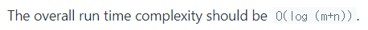
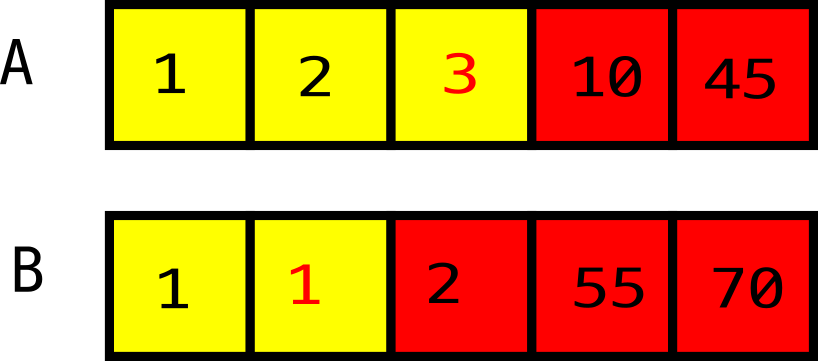
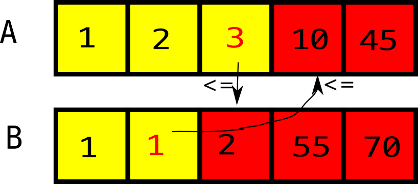
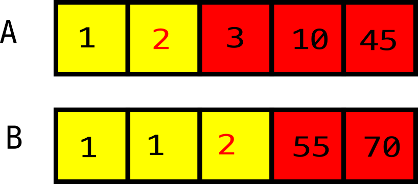
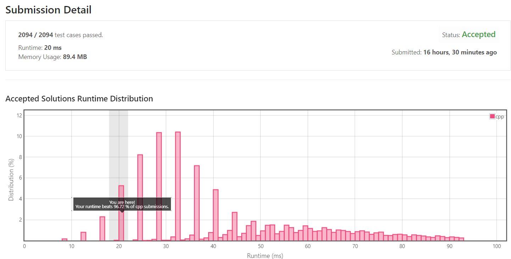

[[[
title : LeetCode - 4. Median of Two Sorted Arrays
date : 2021-10-29 17:36:45
series : "LeetCode"
tags : ["Leet Code", "hard", "c++"]
]]]

## LeetCode - 4. Median of Two Sorted Arrays
문제 - [LeetCode 4. Add Two Numbers](https://leetcode.com/problems/add-two-numbers/)

## 문제 설명
정수 값이 담겨있으며 정렬된 두 배열이 넘어올 때 두 배열의 중앙값(Median)을 계산하는 문제입니다.


[중앙값](https://ko.wikipedia.org/wiki/%EC%A4%91%EC%95%99%EA%B0%92)은 정렬될 수의 배열 중 중앙에 위치하는 값을 말합니다. 수의 개수가 홀수라면 하나가 선택될 것이고, 짝수라면 두 수를 골라 평균을 계산하여 중앙값을 구할 수 있습니다.


만약 위 이미지와 같이 2개의 정렬된 정수 배열이 전달된다면 두 배열의 수를 나란히 나열하면 1, 1, 2, 3, 10, 10, 20, 45, 55, 70으로 나열할 수 있으며 10, 10이 중간값으로 선택되니 (10+10)/2 = 10, 즉 최종적으로 10이 중간값이 될 것입니다.


난이도는 `HARD` 난이도 입니다.

[Reference Video](https://youtu.be/q6IEA26hvXc)

본 문제를 해결하기 위해 위 영상의 설명의 도움을 받았습니다.

## 풀이
### Solution
중간값을 구하기 먼저 문제에 제한사항이 있었습니다.



소스 코드의 시간 복잡도는 O(log(m+n))(m, n은 배열)이 넘지 않아야 합니다. 이로 인해 두 배열을 하나로 합쳐 중간값을 구할 수 없습니다.

두 배열을 하나로 합치기 위해서는 m, n을 순회해야 하므로 O(m+n)의 시간 복잡도가 발생하는데 이는 O(m+n) > O(log(m+n))이므로 배열을 합치지 않고 찾아야 합니다.

이를 해결하기 위해 생각한 방법은 이진 탐색과 비슷한 논리를 이용하는 방법을 떠올렸습니다.

이진 탐색을 수행하기 위해서는 배열이 정렬되어있어야 하고, 맨 처음 중간 값을 골랐을 때 정렬된 배열이라면 중간 값의 왼쪽 값은 당연히 중간 값 보다 작거나 같아야하고, 우측 값은 무조건 중간 값보다 크거나 같아야 합니다.


두 번째 특성은 중간값을 선택하면 중간 값보다 작은 값의 개수와 큰 값의 개수가 동일하다는 것입니다.

이러한 특성을 이용해 두 배열을 합치지 않고 중앙값을 구할 수 있습니다.

**배열의 적절한 Left, Middle, Right 범위 구하기**

맨 처음으로 배열의 중앙값을 구하기 위해서 중앙값을 골랐을 때 작은 값과 큰 값의 개수가 같음을 이용해 적절한 Left(작은 값의 범위), Middle(중앙값), Right(큰 값의 범위)를 구합니다.



두 배열의 길이는 10이기에 두 배열이 하나라고 생각할 때 5, 5로 두 개로 분리할 수 있을 것입니다. 이때 중앙값을 기준으로 Left에 위치한 5개 값, Right에 위치한 5개 값입니다.

먼저 A 배열의 중앙값(A_left)을 선택합니다. 위 그림에서는 3번째가 선택되었으며 Left에 위치한 값 5개를 채우기 위해 B 배열에서 2번째를 선택해 B의 중앙값(B_left)를 선택합니다. 총 5개의 Left가 선택되었으며 나머지 5개를 자동으로 Left보다 큰 값, Right로 선택합니다.

이제 Left, Right나눈 결과가 적절한지 확인합니다, Left의 값들은 무조건 Right의 값보다 작아야 합니다.

1, 1, 1, 2, 3 <-Left  Right-> 2, 10, 45, 55, 70

Left에 3이라는 값이 있지만 Right에 3보다 작은 2가 분류되어있어 지금 선택된 Left와 Right는 적절하지 않음을 알 수 있습니다. 




단순하게 사람의 눈으로 보면 바로 구분이 되지만, 이를 확실하게 구분하는 방법은 A_left(A의 중앙값)은 B_left+1(B의 중앙값의 다음 값)보다 작아야합니다. 반대의 경우도 B_left <= A_left+1이여야 합니다.

이를 해결하기 위해 A의 중앙값 index를 1 감소시키고, B의 중앙값을 1 증가시킵니다.



다시 적절한 분류인지 확인합니다.

1, 1, 1, 2, 2 <-Left  Right-> 3, 10, 45, 55, 70

다시 확인해보니 적절하게 분류되었습니다. 이제 중앙값을 선택해야하는데, 위 처럼 정리하는것은 편의상 일렬로 나란히 정렬한것이지만, 실제로는 두 배열의 index를 각각 가지고 있기 때문에 적절하게 선택할 방법이 필요합니다.

이는 간단하게 수행할 수 있습니다. Left로 분류된 값 중 가장 큰 값이 중앙값일것이며 Right로 분류된 값 중 가장 작은 값이 중앙값일것입니다.

즉 `(max(A_left, B_left) + max(A_right, B_right))/2`가 중앙값이 될 것입니다.

#### 제출 결과


실행시간은 20ms로 다른 C++ 제출자에 비해 96%가량 좋은 성능을 보이는 코드를 작성할 수 있었습니다.

<details>
<summary>코드 전문</summary>
    
```c++
#include <vector>
#include <algorithm>
#include <iostream>
#include <limits>

class Solution 
{
public:
    double findMedianSortedArrays(std::vector<int>& nums1, std::vector<int>& nums2) 
    {
        if (nums1.size() == 0 && nums2.size() == 0)
        {
            return 0.0;
        }

        int totalLength = nums1.size() + nums2.size();
        int half = totalLength / 2;
        
        std::vector<int>& A = nums1;
        std::vector<int>& B = nums2;

        if (nums1.size() < nums2.size())
        {
            auto tmp = A;
            A = nums2;
            B = tmp;
        }

        if (A.size() == 0)
        {
            int mid = B.size() / 2;
            if ((B.size() % 2) == 0)
            {
                return (B[mid - 1] + B[mid]) / 2.0;
            }
            else
            {
                return (double)B[mid];
            }
        }
        else if (B.size() == 0)
        {
            int mid = A.size() / 2;
            if ((A.size() % 2) == 0)
            {
                return (A[mid - 1] + A[mid]) / 2.0;
            }
            else
            {
                return (double)A[mid];
            }
        }

        int l = 0;
        int r = A.size() - 1;

        do 
        {
            int aLeftMidIndex = (l + r) /2;
            int bLeftMidIndex = half - aLeftMidIndex - 2;

            int aLeft = aLeftMidIndex >= 0 ? A[aLeftMidIndex] : std::numeric_limits<int>::min();
            int aRight = (aLeftMidIndex + 1) < A.size() ? A[(aLeftMidIndex + 1)] : std::numeric_limits<int>::max();
            int bLeft = bLeftMidIndex >= 0 ? B[bLeftMidIndex] : std::numeric_limits<int>::min();
            int bRight = (bLeftMidIndex + 1) < B.size() ? B[(bLeftMidIndex + 1)] : std::numeric_limits<int>::max();

            if (aLeft <= bRight && bLeft <= aRight)
            {
                if ((totalLength % 2) == 0)
                {
                    return (std::max(aLeft, bLeft) + std::min(aRight, bRight)) / 2.0;
                }
                else
                {
                    return (double)std::min(aRight, bRight);
                }
            }
            else if (aLeft > bRight)
            {
                r--;
            }
            else if (bLeft > aRight)
            {
                r++;
            }
        } while(true);
    }
};
```

</details>
