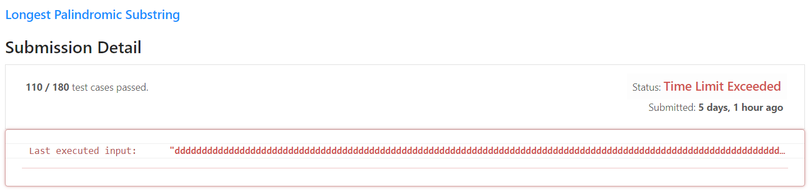
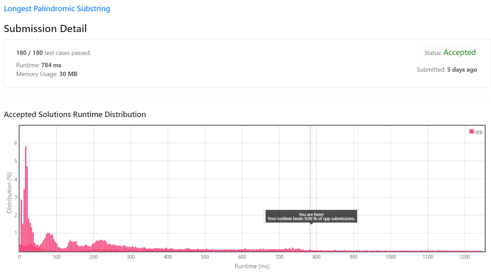
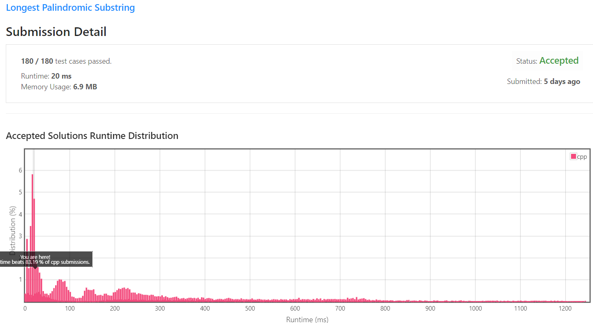

[[[
title : LeetCode - 5. Longest Palindromic Substring
date : 2021-11-06 23:49:00
series : "LeetCode"
tags : ["Leet Code", "medium", "c++"]
]]]

## LeetCode - 5. Longest Palindromic Substring
문제 - [LeetCode 5. Longest Palindromic Substring](https://leetcode.com/problems/longest-palindromic-substring/)

## 문제 설명


이번 문제는 주어진 문자열에서 가장 긴 회문(Palindrome)을 구하는 문제입니다.

회문은 위의 예시 이미지와 같이 문자열을 뒤집어도 동일한 문자열인 경우를 말합니다.

다만, 이번 문제에서는 주어진 문자열이 회문이 아닌, 문자열 내에서 회문인 가장 긴 부분 문자열을 반환하는 문제입니다.

난이도는 `MEDIUM` 난이도 입니다.

## 풀이
### Solution 1 - Brute force
첫 번째로 시도한 방법은 Brute force, 단순히 2중 반복문을 통하여 문자열을 n...j까지 n과 j를 1씩 늘려가며 회문인지 검사하고 반환하는 방법입니다.

```c++
for (int i = 0 ; i < s.size() ; i++)
{
    for (int j = i ; j < s.size() ; j++)
    {
        auto substr = std::string_view(&s[i], (j - i) + 1);
        if (isPalindrome(substr))
        {
            if (longestLength < (j - i) + 1)
            {
                longestLength = (j - i) + 1;
                start = i;
            }
        }
    }
}

return s.substr(start, longestLength);
...

bool isPalindrome(const std::string_view& s)
{
    auto length = s.size();

    for (std::size_t i = 0; i < length; i++)
    {
        if (s[i] != s[length - i - 1]) return false;
    }
    
    return true;
}
``` 

회문을 찾을 수 있는 아주 간단한 방법입니다.

#### 제출 결과


하지만 위 코드를 제출하니 Time Limite Exeeded, 시간 초과가 발생하였습니다.

위 코드는 i..j까지 반복문을 순회할 때의 시간 복잡도는 O(n^2)이며, 회문을 검사하는 코드의 시간 복잡도는 O(n)입니다. 즉 최종적으로 시간 복잡도가 O(n^3)의 코드이기에 매우 긴 문자열을 검사할 때 시간 초과가 발생하게 되었습니다.

<details>
<summary>코드 전문</summary>
    
```c++
#include <string>
#include <string_view>
#include <iostream>

class Solution 
{
public:
    std::string longestPalindrome(std::string s) 
    {
        if (s.size() == 1 || s.size() == 0) return s;

        int longestLength = 0;
        int start = 0;

        for (int i = 0 ; i < s.size() ; i++)
        {
            for (int j = i ; j < s.size() ; j++)
            {
                auto substr = std::string_view(&s[i], (j - i) + 1);
                if (isPalindrome(substr))
                {
                    if (longestLength < (j - i) + 1)
                    {
                        longestLength = (j - i) + 1;
                        start = i;
                    }
                }
            }
        }
        
        return s.substr(start, longestLength);
    }

private:
    bool isPalindrome(const std::string_view& s)
    {
        auto length = s.size();

        for (std::size_t i = 0; i < length; i++)
        {
            if (s[i] != s[length - i - 1]) return false;
        }
        
        return true;
    }
};
```

</details>

### Solution 2 - Dynamic programming
두 번째 방법은 동적 프로그래밍(Dynamic programming)을 이용한 풀이입니다.

회문의 특성을 생각해볼때 만약 *abcba*라는 회문 문자열이 존재한다면 해당 문자열의 부분 문자열 *bcb*또한 회문이며, *bcb*의 부분 문자열 *c*또한 회문임을 알 수 있습니다.

두 번째로 문자가 하나인 경우 *c*와 같은 경우는 무조건 회문입니다. 그리고 만약 *c*의 앞뒤로 문자가 하나씩 추가 될 때 두 문자가 같다면, *bcb*가 된다면 이 또한 회문이 됩니다.

이러한 특성과 동적 프로그래밍을 이미 회문을 검사한 문자열을 또 검사하지 않고 새로운 회문 문자열을 찾을 수 있습니다.

먼저 규칙을 정의합니다.
1. S(i, j) : 문자열 S에 대해서 i번째부터 j번째까지의 부분 문자열
2. S(i, i) = 회문
3. S(i, i+1) = S_i == S_i+1일 경우 회문
4. S(i, j) = S(i+1, j-1) && S_i == S_j 일 경우 회문

2번 규칙의 경우 S(i, i)는 S문자열의 i번째부터 i번째까지 부분 문자열, 즉 하나의 문자에 대해서 회문임을 확인하기에 무조건 회문입니다.

3번 규칙은 S(i, i+1)는 선택한 문자와 인접한 문자가 같다면 회문임을 나타냅니다. **"bb"** 와 같은 경우를 나타냅니다.

4번 규칙은 위에서 말했듯이 부분 문자열이 회문이고, 앞 뒤로 추가되는 문자열이 같다면 새로 추가되는 문자열도 회문임을 나타냅니다.

```c++
std::vector<std::vector<bool>> dp(s.size(), std::vector<bool>(s.size(), false));
```

`std::vector` STL 컨테이너를 이용해 2차원 동적 배열을 선언합니다.

```c++
for (int j = 0 ; j < s.size() ; j++)
{
    for (int i = 0 ; i <= j ; i++)
    {
        bool same = s[i] == s[j];

        // 문자열 길이가 2이상일때는 dp[i + 1][j - 1]즉, substr이 회문이여야 함
        // 문자열 길이가 2일경우(i, i+1) 두 문자가 같아야 회문
        // 문자열 길이가 1일경우 무조건 회문
        dp[i][j] = j - i > 2 ? (dp[i + 1][j - 1] && same) : same;
        
        if ((longestLen < (j - i + 1)) && dp[i][j])
        {
            longestLen = j - i + 1;
            start = i;
        }
    }
}
```

i와 j는 각각 S(i, j)로 부분문자열 시작 index인 i부터 j까지를 나타냅니다. 

j - i가 2보다 작으면 규칙 2와 규칙 3을 적용할 수 있기에 단순히 S_i와 S_j를 비교한 결과가 저장됩니다.

j - i가 2보다 큰 경우는 문자열의 길이가 최소 3이상이므로 부분 문자열이 회문인지 검사하고 새로 추가된 문자 둘이 같은지 확인해야 합니다. S(i, j)의 부분 문자열 S(i+1, j-1)은 이미 계산이 되어 배열에 삽입되어 있을태니 추가로 계산할 필요 없이 값을 조회만 하면 됩니다.

마지막으로 지금 확인한 문자열이 회문이고 가장 길다면 해당 문자열의 인덱스를 저장합니다.

#### 제출 결과


1번 해결 방법의 경우 O(n^3)이기 때문에 시간 초과가 발생했지만, 이번 방법의 경우 O(n^2)의 시간 복잡도이기 때문에 시간 초과가 발생하지 않았습니다.

784ms 시간이 소요되었으며 다른 C++코드 제출자에 비해서 10% 정도의 성능밖에 보이지 않았습니다.

<details>
<summary>코드 전문</summary>
    
```c++
#include <string>
#include <string_view>
#include <iostream>
#include <vector>

class Solution 
{
public:
    std::string longestPalindrome(std::string s) 
    {
        if (s.size() == 1 || s.size() == 0) return s;

        int longestLen = 0;
        int start = 0;

        std::vector<std::vector<bool>> dp(s.size(), std::vector<bool>(s.size(), false));

        // 열 기반으로 탐색
        for (int j = 0 ; j < s.size() ; j++)
        {
            for (int i = 0 ; i <= j ; i++)
            {
                bool same = s[i] == s[j];

                // 문자열 길이가 2이상일때는 dp[i + 1][j - 1]즉, substr이 회문이여야 함
                // 문자열 길이가 2일경우(i, i+1) 두 문자가 같아야 회문
                // 문자열 길이가 1일경우 무조건 회문
                dp[i][j] = j - i > 2 ? (dp[i + 1][j - 1] && same) : same;
                
                if ((longestLen < (j - i + 1)) && dp[i][j])
                {
                    longestLen = j - i + 1;
                    start = i;
                }
            }
        }

        return s.substr(start, longestLen);
    }
};
```

</details>

### Solution 3 - Expand around center
회문을 검사하기 위해서는 문자열을 시작과 끝을 정해서 회문을 검사하는 방법도 있지만, 문자열의 가운데부터 좌우로 확장하면서 회문임을 검사하는 방법도 있습니다.

```c++
for (int i = 0 ; i < s.size() ; i++)
{
    int len1 = expandAroundCenter(s, i, i);
    int len2 = expandAroundCenter(s, i, i + 1);
    int len = std::max(len1, len2);

    if (len > end - start)
    {
        start = i - (len - 1) / 2;
        end = i + len / 2;
    }
}
```

`expandAroundCenter` 함수는 i를 기준으로 좌우로 확장하며 회문인지 검사하는 함수입니다.

```c++
int expandAroundCenter(const std::string& s, int left, int right)
{
    while ( left >= 0 && right < s.size() && s[left] == s[right])
    {
        left--;
        right++;
    }

    return right - left - 1;
}
```

`expandAroundCenter` 함수를 i와 i+1에 대해서 호출하는 이유는 문자열이 짝수인경우 회문의 중앙 문자가 2개가 존재하기 때문에 두 경우 중 긴 문자열을 선택합니다.

#### 제출 결과


이번 방법의 시간 복잡도는 O(n^2)이며 동적 프로그래밍과 동일합니다. 다만 공간 복잡도가 동적 프로그래밍은 O(n^2)이지만, 이번 방법의 공간 복잡도는 O(1)이기때문에 동적 프로그래밍 방법과 비교하면 메모리 사용량에서 많은 차이가 발생함을 확인할 수 있습니다.

<details>
<summary>코드 전문</summary>
    
```c++
#include <string>
#include <iostream>
#include <algorithm>

class Solution 
{
public:
    std::string longestPalindrome(std::string s) 
    {
        if (s.size() == 1 || s.size() == 0) return s;

        int start = 0;
        int end = 0;

        for (int i = 0 ; i < s.size() ; i++)
        {
            int len1 = expandAroundCenter(s, i, i);
            int len2 = expandAroundCenter(s, i, i + 1);
            int len = std::max(len1, len2);

            if (len > end - start)
            {
                start = i - (len - 1) / 2;
                end = i + len / 2;
            }
        }
        
        return s.substr(start, (end - start) + 1);
    }
private:
    int expandAroundCenter(const std::string& s, int left, int right)
    {
        while ( left >= 0 && right < s.size() && s[left] == s[right])
        {
            left--;
            right++;
        }

        return right - left - 1;
    }
};
```

</details>