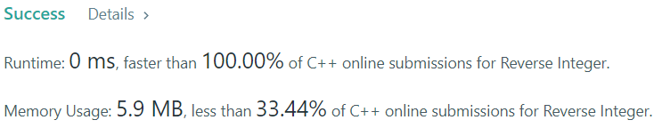

[[[
title : LeetCode - 7. Reverse Integer
date : 2021-11-08 14:07:30
series : "LeetCode"
tags : ["Leet Code", "medium", "c++"]
]]]

## LeetCode - 7. Reverse Integer
문제 - [LeetCode 7. Reverse Integer](https://leetcode.com/problems/reverse-integer/)

## 문제 설명
정수 123이 주어진다면 321로, -123이 주어진다면 -321, 1200이 주어진다면 21로 변환하는 문제입니다.

난이도는 `MEDIUM` 난이도 입니다.

## 풀이
### Solution

```c++
while (x != 0)
{   
    if (result > (INT_MAX / 10)) return 0;
    else if (result < (INT_MIN / 10)) return 0;

    result *= 10;
    result += (x % 10);

    x /= 10;
}
```
단순히 입력 값 x의 나머지를 result에 더하고 다음 순회시 result에 10을 곱하여 변환하는 방식을 사용했습니다.

입력값은 `int` 타입이므로 32bit 크기의 자료형이기 때문에 만약 입력값이 뒤집었을 때 `int` 자료형의 크기가 넘을 경우 0을 반환하는 예외 처리를 수행합니다.

이번 문제에서는 `INT_MAX`의 값을 이용해 `int` 타입의 범위를 검사하였지만, `long`과 같이 `int`타입보다 더 큰 자료형을 이용한다면 별도의 예외 처리가 필요하지 않습니다.

#### 제출 결과


0ms의 실행결과가 나왔으며, 다른 C++ 제출자에 비해 100% 좋은 성능이 보임을 확인할 수 있습니다.

<details>
<summary>코드 전문</summary>
    
```c++
#include <cmath>
#include <climits>

class Solution 
{
public:
    int reverse(int x) 
    {
        if (x == 0) return x;

        int result = 0;

        while (x != 0)
        {   
            if (result > (INT_MAX / 10)) return 0;
            else if (result < (INT_MIN / 10)) return 0;

            result *= 10;
            result += (x % 10);

            x /= 10;
        }

        return result;
    }
};
```

</details>
