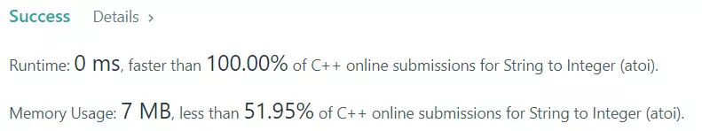

[[[
title : LeetCode - 8. String to Integer (atoi)
date : 2021-11-08 15:00:00
series : "LeetCode"
tags : ["Leet Code", "medium", "c++"]
]]]

## LeetCode - 8. String to Integer (atoi)
문제 - [LeetCode 8. String to Integer (atoi)](https://leetcode.com/problems/string-to-integer-atoi/)

## 문제 설명
문자열에서 정수형으로 parse하는 atoi 함수를 구현하는 문제입니다.

문자열에서 정수형으로 변환할 때 지켜야할 여러 규칙이 존재합니다.

1. 공백 문자는 모두 무시한다.
2. '-', '+' 문자가 처음으로 등장하고 이미 등장한적이 없다면 각 부호가 정수의 부호를 결정합니다. 만약 어떠한 부호도 등장하지 않았다면 양수로 가정합니다.
3. 숫자 문자가 아닌 문자가 등장하면 남은 모든 문자는 무시합니다.
4. 숫자 문자는 정수형으로 변환합니다. 만약 숫자가 아니라면 정수 값은 0으로 결정됩니다.
5. 만약 정수형 범위를 벗어난다면 정수형 범위의 최대,최소 값을 반환합니다.

난이도는 `MEDIUM` 난이도 입니다.

## 풀이
### Solution

```c++
for (int index = 0; index < s.size() ; index++)
{
    char chr = s[index];
    
    ...
}
```

먼저 문자열을 순회합니다.

```c++
if ((chr < '0' || chr > '9') && !((result == 0) && (chr == '+' || chr == '-')))
{
    if (result == 0 && !(chr == '+' || chr == '-' || chr == ' ')) break;
    if (chr == '.') break;

    if (findSign) break;
    else continue;
}
```

순회시 숫자 문자가 아니거나, 이미 부호가 결정되었을 때 -, + 문자가 탐색되는 경우를 처리합니다.

```c++
if (chr == '+') 
{
    if (findSign) break;
    neg = false;
    findSign = true;
}
else if (chr == '-') 
{
    if (findSign) break;
    neg = true;
    findSign = true;
}
else 
{
    int num = (neg ? -(chr - '0') : (chr - '0'));
    if (result > INT_MAX/10 || (result == INT_MAX / 10 && num > 7)) return INT_MAX;
    if (result < INT_MIN/10 || (result == INT_MIN / 10 && num < -8)) return INT_MIN;

    findSign = true;
    result *= 10;
    result = result + num;
}
```

부호 문자라면 부호를 결정하고, 숫자라면 수를 계산하여 result 변수에 저장합니다.


#### 제출 결과


0ms의 실행 결과가 나왔습니다.

<details>
<summary>코드 전문</summary>
    
```c++
#include <string>
#include <climits>

class Solution 
{
public:
    int myAtoi(std::string s) 
    {
        if (!s.size()) return 0;

        int result = 0;
        bool neg = false;
        bool findSign = false;

        for (int i = s.size() - 1; i >= 0 ; i--)
        {
            int index = s.size() - i - 1;
            char chr = s[index];

            if ((chr < '0' || chr > '9') && !((result == 0) && (chr == '+' || chr == '-')))
            {
                if (result == 0 && !(chr == '+' || chr == '-' || chr == ' ')) break;
                if (chr == '.') break;

                if (findSign) break;
                else continue;
            }

            if (chr == '+') 
            {
                if (findSign) break;
                neg = false;
                findSign = true;
            }
            else if (chr == '-') 
            {
                if (findSign) break;
                neg = true;
                findSign = true;
            }
            else 
            {
                int num = (neg ? -(chr - '0') : (chr - '0'));
                if (result > INT_MAX/10 || (result == INT_MAX / 10 && num > 7)) return INT_MAX;
                if (result < INT_MIN/10 || (result == INT_MIN / 10 && num < -8)) return INT_MIN;

                findSign = true;
                result *= 10;
                result = result + num;
            }
        }

        return result;
    }
};
```

</details>
