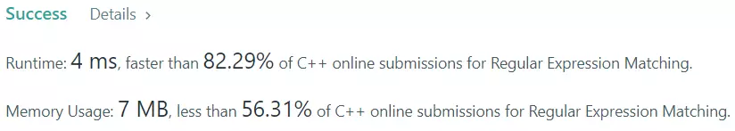

[[[
title : LeetCode - 10. Regular Expression Matching
date : 2021-11-10 22:23:11
series : "LeetCode"
tags : ["Leet Code", "hard", "c++"]
]]]

## LeetCode - 10. Regular Expression Matching
문제 - [LeetCode 10. Regular Expression Matching](https://leetcode.com/problems/regular-expression-matching/)

## 문제 설명


정규 표현식은 주어진 문자열에 대해서 패턴 문자열(정규 표현식)이 주어지면 해당 패턴을 갖는 문자열을 표현하는 방법입니다.

이번 문제에서는 Any character를 나타내는 `"."` 과 0 또는 하나 이상의 문자 집합을 나타내는 `"*"` 패턴 문자를 구현하는 문제입니다.

난이도는 `HARD` 난이도 입니다.

## 풀이
### Solution - Dynamic programming
본 문제를 풀기 위해서 동적 프로그래밍 방법을 사용하였습니다.

패턴을 찾기 위해서 문자열과 패턴 문자열을 모두 순회하면서 패턴을 찾아야 합니다.

여기서 한가지 특성은 만약 패턴 "a*"가 주어졌을 때 부분 패턴 문자열 "a"가 문자열에 매칭될 경우에 참이되며 추가적인 "a"를 찾을 수도 있고, 찾기 못하더라도 참이 되게때문에 여러 분기가 발생하게 됩니다.

동적 프로그래밍 방법을 이용해 부분 패턴 문자열을 순회하면서 참인 경우를 따로 저장하여 나중에 똑같은 부분 패턴을 조회할 때 똑같은 검사를 수행하지 않고 저장한 값을 반환하여 성능 향상을 노릴 수 있습니다.

```c++
std::vector<std::vector<char>> dp;

bool isMatch(int i, int j, const std::string& s ,const std::string& p)
{
    if (dp[i][j] != -1) return dp[i][j];

    ...

    return match;
}
```

먼저 2차원 배열을 선언합니다. 이 배열이 이전에 계산한 결과를 저장할 것입니다. boolean이 아닌 char 타입으로 한 이유는 아직 i, j 번째를 순회하지 않았을 경우를 따로 나타내기 위해서 모든 값을 -1으로 초기화 하였습니다.

`isMatch` 함수는 i, j, 문자열, 패턴 문자열이 주어지는 함수입니다. i는 s의 부분 문자열의 시작 인덱스, j는 부분 패턴 문자열의 시작 인덱스를 나타냅니다.

```c++
bool firstMatch = (i < s.length()) && (p[j] == s[i] || p[j] == '.');

// if Kleene star, character matches zero or more
if (j + 1 < p.length() && p[j + 1] == '*')
{
            // If zero match, skip Kleene star
    match = isMatch(i, j + 2, s, p) || 
            // If non-zero matches, keep finding more matches character
            (firstMatch && isMatch(i + 1, j, s, p));
}
else
{
    // Finding next matches character
    match = firstMatch && isMatch(i + 1, j + 1, s, p);
}
```

매칭을 수행하는 부분만 따로 빼서 자세히 확인해보겠습니다. 먼저 현재 패턴 문자와 입력 문자가 같은지 확인합니다. 만약 패턴 문자가 `'.'` 이라면 모든 문자와 매칭되니 `true`가 될 것입니다.

만약 0또는 1개 이상의 문자 집합을 매칭하는 `'*'` 문자는 "a*"와 같이 다른 문자와 함께 붙어서 나오기 때문에 해당 부분에 대해서 확인하고 예외 처리를 진행합니다.

`'*'` 문자는 0개 또는 1개 이상의 문자열과 매칭되기 때문에 첫 번째로 0개가 매칭 되었을 경우 `isMatch(i, j + 2, s, p)`에 대해서 확인합니다. `j+2`의 의미는 패턴 문자열의 시작 인덱스를 2만큼 증가시키니 `'*'` 문자 이후의 패턴들을 검사합니다.

두 번째로 하나의 문자가 매치되었을 경우(firstMatch) 현재 문자 이후의 문자가 계속 연속적으로 매칭되는지 확인합니다 `(firstMatch && isMatch(i+1, j, s, p))`

만약 `'*'` 문자가 아니고 문자 매칭이라면 i + 1, j + 1에 대해서 계속 매치를 시도합니다.

#### 제출 결과


<details>
<summary>코드 전문</summary>
    
```c++
#include <string>
#include <vector>

class Solution 
{
public:
    bool isMatch(std::string s, std::string p) 
    {
        std::vector<std::vector<char>> tmp(s.size() + 1, std::vector<char>(p.size() + 1, -1));
        dp.swap(tmp);

        return isMatch(0, 0, s, p);
    }

private:
    std::vector<std::vector<char>> dp;

    bool isMatch(int i, int j, const std::string& s ,const std::string& p)
    {
        if (dp[i][j] != -1) return dp[i][j];

        char match = -1;

        // If no more patterns
        if (j == p.length())
        {
            // True when no more string, If string does not empty, False
            match = (i == s.length());
        }
        else 
        {
            bool firstMatch = (i < s.length()) && (p[j] == s[i] || p[j] == '.');

            // if Kleene star, character matches zero or more
            if (j + 1 < p.length() && p[j + 1] == '*')
            {
                        // If zero match, skip Kleene star
                match = isMatch(i, j + 2, s, p) || 
                        // If non-zero matches, keep finding more matches character
                        (firstMatch && isMatch(i + 1, j, s, p));
            }
            // 
            else
            {
                // Finding next matches character
                match = firstMatch && isMatch(i + 1, j + 1, s, p);
            }
        }

        dp[i][j] = match;

        return match;
    }
};
```

</details>
