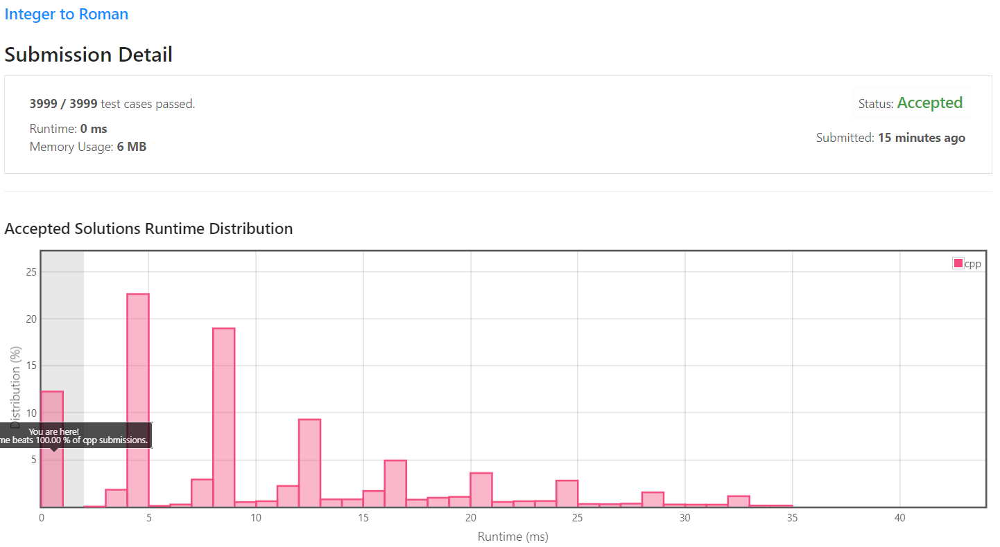

[[[
title : LeetCode - 12. Integer to Roman
date : 2021-11-15 23:01:00
series : "LeetCode"
tags : ["Leet Code", "medium", "c++"]
]]]

## LeetCode - 12. Integer to Roman
문제 - [LeetCode 12. Integer to Roman](https://leetcode.com/problems/integer-to-roman/)

## 문제 설명
정수형 숫자가 입력되면 해당 숫자를 로마자 숫자로 변환하는 문제입니다.

또한, 수의 범위는 `1 <= x <= 3999` 사이로만 입력됩니다.

난이도는 `MEDIUM` 난이도 입니다.

## 풀이
### Solution

난이도에 비해 문제가 쉽기 때문에 큰 설명은 필요하지 않을 듯 합니다.

이번에 푸는 방식은 수의 범위가 넓지 않기에 if 문을 활용해 10의 배수에 따라 적절한 문자로 치환하는 방식을 사용하였지만, 필요에 따라 테이블 형태의 자료형에 저장하여 참조하는 방식으로 구현해도 될 듯 합니다.

#### 제출 결과


<details>
<summary>코드 전문</summary>
    
```c++
#include <string>

class Solution 
{
public:
    std::string intToRoman(int num) 
    {
        std::string result = "";

        int multiple = 0;
        while (num > 0)
        {
            int digit = num % 10;

            std::string one = "I";
            std::string four = "IV";
            std::string five = "V";
            std::string nine = "IX";

            if (multiple == 1)
            {
                one = "X";
                four = "XL";
                five = "L";
                nine = "XC";
            }
            else if (multiple == 2)
            {
                one = "C";
                four = "CD";
                five = "D";
                nine = "CM";
            }
            else if (multiple == 3)
            {   
                one = "M";
            }

            if (digit == 4) result.insert(0, four);
            else if (digit == 9) result.insert(0, nine);
            else
            {
                std::string tmp = "";

                if (digit >= 5)
                {
                    tmp += five;
                    digit -= 5;
                }

                for (int i = 0; i < digit; i++)
                {
                    tmp += one;
                }
                
                result.insert(0, tmp);
            }

            multiple++;
            num /= 10;
        }

        return result;
    }
};
```

</details>
