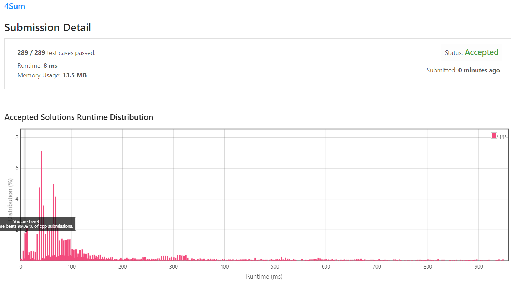

[[[
title : LeetCode - 18. 4Sum
date : 2021-11-29 21:06:36
series : "LeetCode"
tags : ["Leet Code", "medium", "c++"]
]]]

## LeetCode - 18. 4Sum
문제 - [LeetCode - 18. 4Sum](https://leetcode.com/problems/4sum/)

## 문제 설명
이전까지 [Two Sum](https://jaehee.dev/#/post/1), [3 Sum](https://jaehee.dev/#/post/15) 과 같은 문제를 풀었습니다.

이번에는 4 Sum입니다. 숫자 배열이 주어지면 숫자 네 개를 더했을 때 target 숫자가 나타나는 모든 가지수를 찾는 문제입니다. 

Two Sum은 Hash table 방식을 이용하여 풀었고, 3 Sum은 Two pointer 방식을 이용하여 풀었습니다. Two pointer 방식은 left를 가리키는 인덱스와 right 인덱스를 이용하여 target 숫자에 가까워지도록 left, right의 포인터를 조정하는 방식이였습니다.

3 Sum에서 Two pointer를 활용할 때 숫자 하나를 고정해놓고 left, right 포인터를 조정하는 방식으로 풀었습니다. 즉, 숫자 하나를 고정해놓고 Two Sum을 수행한 것과 동일합니다.

즉 4 Sum 또한 숫자 하나를 고정해놓고 3 Sum을 수행한다면 4 Sum의 결과를 얻을 수 있을 것입니다.

Leetcode의 Solution과 동일하게 이번에는 4 Sum을 딱 정해서 푸는 것이 아닌, k-Sum에 대해서 문제를 풀어보았습니다.

난이도는 `MEDIUM` 난이도 입니다.

## 풀이
[My Solutions(Github)](https://github.com/LDobac/leetcode/tree/master/17.%20Letter%20Combinations%20of%20a%20Phone%20Number)

### Solution - kSum

이번에 풀어볼 방법은 3 Sum과 동일하게 Two pointer, 즉 left, right 포인터를 target에 가까운 숫자가 되도록 좁혀가는 방식을 사용할 것입니다. 

Two pointer 방법이 가능한 이유는 주어진 숫자 배열이 정렬되어있기 때문에 left 포인터가 무조건 right 포인터가 가리키는 숫자보다 작거나 같게됩니다. 때문에 해당 방법을 사용할때는 무조건 주어진 숫자 배열을 정렬해야합니다.

```c++
vector<vector<int>> fourSum(vector<int>& nums, int target) 
{
    sort(nums.begin(), nums.end());

    return kSum(nums, target, 0, 4);
}

vector<vector<int>> kSum(vector<int>& nums, int target, int start, int k)
{
    ...
}
```

그리고 kSum으로 일반화한 함수를 호출하여 k = 4인 경우에 대해서 호출합니다.

앞서 설명했듯이 3 Sum은 숫자 하나를 고정하고 나머지 숫자들로 2 Sum을 수행하는 방식으로 설명할 수 있습니다.

동일하게 4 Sum 또한 숫자 하나를 고정하고 3 Sum을 호출하는 방법으로 결과를 구할 수 있습니다.

```c++
for (int i = start; i < nums.size(); i++)
{
    if (i != start && nums[i - 1] == nums[i]) continue;

    auto subsets = kSum(nums, target - nums[i], i + 1, k -1);

    for (auto subset : subsets)
    {
        subset.push_back(nums[i]);

        result.push_back(subset);
    }
}
```

k - 1 Sum을 구하는 방법은 매우 간단하게 이루어집니다.

수 하나(여기선 nums[i])를 고정하고, 고정한 수를 제외하고 k - 1 Sum을 호출합니다. 즉, 재귀적으로 k Sum이 이루어지게 됩니다.

```c++
if (i != start && nums[i - 1] == nums[i]) continue;
```

위 if문은 이전에 고정한 숫자와 현재 고정할 숫자가 같으면 스킵합니다. 이전과 똑같은 숫자를 고정하여 탐색하면 nums[i - 1]에 대한 subset을 탐색하기 때문입니다. 자세한 설명은 3 Sum을 참조하시면 좋습니다.

```c++
for (auto subset : subsets)
{
    subset.push_back(nums[i]);

    result.push_back(subset);
}
```

k - 1 Sum으로 반환된 결과에 현재 고정한 숫자를 합쳐서 결과에 반영합니다.

만약 k=2가 된다면 twoSum을 호출하는게 맞겠죠
```c++
if (k == 2)
{
    return twoSum(nums, target, start);
}
```

twoSum 함수에 대해서는 여기서는 설명을 하지 않겠습니다. 3 Sum 게시글을 참고하시거나, 게시글 하단의 코드 전문을 보시면 확인할 수 있습니다.

이게 끝입니다. 지금까지 수행한 과정은 다음과 같습니다.
1. 입력 배열을 정렬한다.
2. kSum을 호출한다. (여기선 k=4)
3. k-1 Sum을 재귀적으로 호출한다.
4. k = 2일 경우 Two Sum을 호출한다.
5. Two Sum으로 반환된 결과에 고정된 숫자를 합쳐 반환한다. 

#### 제출 결과


<details>
<summary>코드 전문</summary>

```c++
class Solution 
{
public:
    vector<vector<int>> fourSum(vector<int>& nums, int target) 
    {
        sort(nums.begin(), nums.end());

        return kSum(nums, target, 0, 4);
    }

    vector<vector<int>> kSum(vector<int>& nums, int target, int start, int k)
    {
        vector<vector<int>> result;

        if (start >= nums.size())
        {
            return result;
        }

        int average = target / k;

        if  (nums[start] > average || average > nums.back()) 
        {
            return result;
        }

        if (k == 2)
        {
            return twoSum(nums, target, start);
        }

        for (int i = start; i < nums.size(); i++)
        {
            if (i != start && nums[i - 1] == nums[i]) continue;

            auto subsets = kSum(nums, target - nums[i], i + 1, k -1);

            for (auto subset : subsets)
            {
                subset.push_back(nums[i]);

                result.push_back(subset);
            }
        }
        
        return result;
    }

    vector<vector<int>> twoSum(vector<int>& nums, int target, int start)
    {
        vector<vector<int>> result;

        int left = start;
        int right = nums.size() - 1;

        while (left < right)
        {
            int sum = nums[left] + nums[right];

            if (sum < target)
            {
                left++;
            }
            else if (sum > target)
            {
                right--;
            }
            else
            {
                 result.push_back({nums[left], nums[right]});

                left++;
                while (nums[left] == nums[left - 1] && left < right) left++;
            }
        }

        return result;
    }
};
```

</details>
