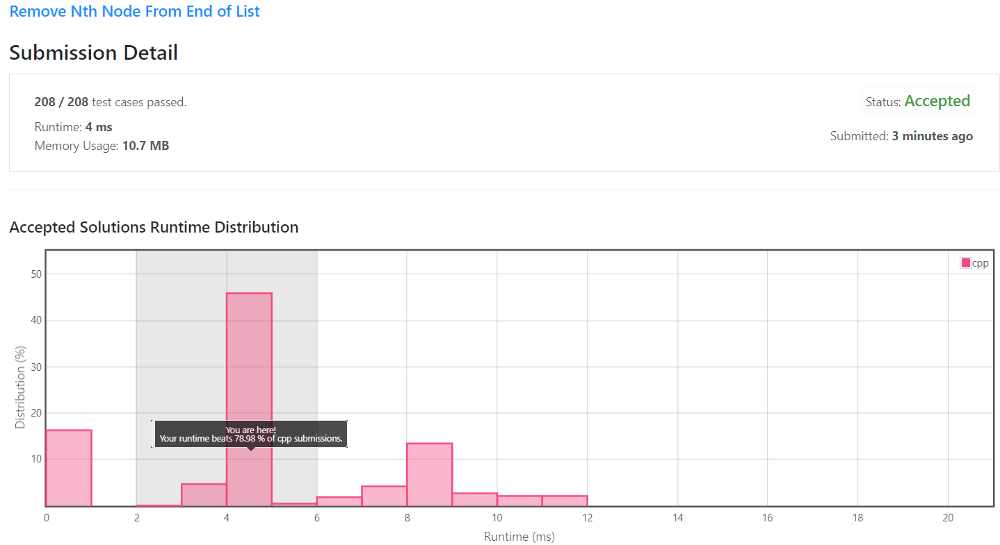

[[[
title : LeetCode - 19. Remove Nth Node From End of List
date : 2021-12-01 20:57:17
series : "LeetCode"
tags : ["Leet Code", "medium", "c++"]
]]]

## LeetCode - 19. Remove Nth Node From End of List
문제 - [LeetCode - 19. Remove Nth Node From End of List](https://leetcode.com/problems/remove-nth-node-from-end-of-list/)

## 문제 설명


단방향 연결 리스트와 삭제할 인덱스가 입력으로 주어집니다.

삭제할 인덱스는 연결 리스트의 끝에서 n번째의 노드를 삭제합니다.

위 사진의 예시는 [1, 2, 3, 4, 5]의 연결 리스트가 주어지고, n = 2가 주어졌기 때문에 리스트의 끝에서 2번째인 `[4]` 노드가 삭제됩니다.

난이도는 `MEDIUM` 난이도 입니다.

## 풀이
[My Solutions(Github)](https://github.com/LDobac/leetcode/tree/master/19.%20Remove%20Nth%20Node%20From%20End%20of%20List)

### Solution
양방향 연결 리스트가 아니고, 단방향이기 때문에 next 포인터 밖에 없습니다.

때문에 리스트의 끝에서 n번쨰 노드를 삭제하기 위해서는 2번의 리스트 순회가 필요합니다. 

첫번째 순회는 연결 리스트의 길이를 알아내는 것입니다. 연결 리스트의 길이를 알아야 연결 리스트의 끝에서 n 번째 노드를 알아낼 수 있습니다.

```c++
ListNode* cur = head;
int length = 0;
while (cur)
{
    length++;

    cur = cur->next;
}
```

그리고 두 번째 순회는 삭제할 노드를 찾기 위해 순회해야 합니다. 연결 리스트의 길이는 알아냈으니 뒤에서 n번째 노드를 찾기 위해서는 length - n번 순회 하면 됩니다.

```c++
ListNode* prevOfTarget = nullptr;
ListNode* target = head;
for (int i = length - n; i > 0; i--)
{
    prevOfTarget = target;
    target = target->next;
}
```

단방향 연결 리스트이니 삭제할 노드와 해당 이전 노드를 따로 변수로 저장합니다.

```c++
if (prevOfTarget == nullptr)
{
    head = target->next;
}
else
{
    prevOfTarget->next = target->next;
}
```

만약 이전 노드가 `nullptr`이라면 head노드를 삭제하는게 되니, head노드를 삭제할 노드의 다음 노드를 가리키게 합니다.

아니라면 일반 연결 리스트 삭제 과정을 수행합니다.


#### 제출 결과


실행 속도는 4ms가 나왔습니다. 아마도 실행시마다 조금씩 달라지는 leetcode의 실행속도 때문에 4ms가 나온 듯 합니다. 아마 재시도를 몇 번 더 하면 0ms의 실행 속도가 나올수도 있을 듯 합니다.

<details>
<summary>코드 전문</summary>

```c++
class Solution 
{
public:
    ListNode* removeNthFromEnd(ListNode* head, int n) 
    {
        if (!head->next && n > 0)
        {
            return nullptr;
        }

        ListNode* cur = head;
        int length = 0;
        while (cur)
        {
            length++;

            cur = cur->next;
        }
        
        ListNode* prevOfTarget = nullptr;
        ListNode* target = head;
        for (int i = length - n; i > 0; i--)
        {
            prevOfTarget = target;
            target = target->next;
        }

        if (prevOfTarget == nullptr)
        {
            head = target->next;
        }
        else
        {
            prevOfTarget->next = target->next;
        }
        
        return head;
    }
};
```

</details>
