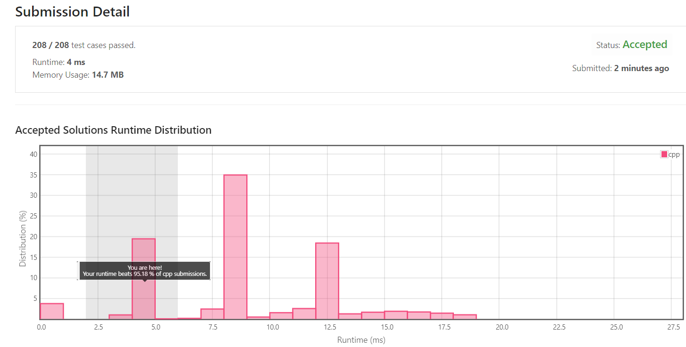

[[[
title : LeetCode - 21. Merge Two Sorted Lists
date : 2021-12-06 21:08:37
series : "LeetCode"
tags : ["Leet Code", "easy", "c++"]
]]]

## LeetCode - 21. Merge Two Sorted Lists
문제 - [LeetCode - 21. Merge Two Sorted Lists](https://github.com/LDobac/leetcode/tree/master/21.%20Merge%20Two%20Sorted%20Lists)

## 문제 설명
오름차순으로 정렬된 두 연결 리스트가 입력으로 들어옵니다.

단순히 두 연결 리스트를 오름차순으로 하나의 연결 리스트로 합쳐 반환하면 됩니다.


난이도는 `EASY` 난이도 입니다.

## 풀이
[My Solutions(Github)](https://github.com/LDobac/leetcode/tree/master/14.%20Longest%20Common%20Prefix)

### Solution
EASY 난이도인 만큼 크게 어려운 문제는 아닙니다.

두 연결 리스트를 순회하면서 크기가 작은 노드를 골라(오름차순으로 연결해야 하니) 새로운 연결 리스트에 연결해주면 됩니다.

```c++
ListNode* mergedHead = nullptr;
ListNode* lastNode = nullptr;

ListNode* node1 = list1;
ListNode* node2 = list2;
```

먼저 새로운 연결 리스트의 head 포인터인 `mergedHead`포인터를 선언하고, 일종의 tail 포인터 역할을 맡는 `lastNode`포인터를 선언합니다.

새로운 연결 리스트를 구성할때는 항상 마지막에 노드를 삽입해야하기 때문에 별도의 tail 포인터를 사용합니다.

그리고 입력된 두 연결 리스트의 순회를 위해 `node1`, `node2` 포인터를 선언하여 초기화합니다.

```c++
while (node1 && node2)
{ ... }
```

이제 두 리스트를 동시에 순회합니다. 두 리스트의 노드의 크기를 비교해야 하기 때문에 동시에 순회하여야 합니다.

만약 한 쪽 리스트의 노드가 남는다면, 어차피 정렬되어있는 리스트이기때문에 그대로 붙이기만 하면 됩니다.

```c++
ListNode* selectedNode = nullptr;
if (node1->val < node2->val)
{
    selectedNode = node1;
    node1 = node1->next;
}
else
{
    selectedNode = node2;
    node2 = node2->next;
}

if (mergedHead == nullptr)
{
    mergedHead = selectedNode;
}
else
{
    lastNode->next = selectedNode;
}

lastNode = selectedNode;
```

while loop문의 내부 코드입니다.

```c++
ListNode* selectedNode = nullptr;
if (node1->val < node2->val)
{
    selectedNode = node1;
    node1 = node1->next;
}
else
{
    selectedNode = node2;
    node2 = node2->next;
}
```

첫 번째로는 새로운 연결 리스트에 붙일 노드를 선택합니다. 새로운 연결 리스트도 오름차순으로 정렬되어서 반환되어야 하기때문에 두 노드 중 크기가 작은 노드를 선택합니다.

```c++
if (mergedHead == nullptr)
{
    mergedHead = selectedNode;
}
else
{
    lastNode->next = selectedNode;
}
```

그리고 노드를 새로운 연결 리스트에 삽입합니다. 만약 새 연결 리스트의 head가 nullptr라면 첫 순회이니 그냥 삽입하고, 아니라면 tail 노드의 next 포인터로 가리키게 합니다.

```c++
lastNode = selectedNode;
```

그리고 방금 삽입한 노드를 tail 포인터에 저장합니다.

#### 제출 결과


실행 속도는 4ms가 나왔으며, 다른 C++ 제출자에 비해 95% 가량의 속도가 나왔습니다. 

크게 어려운 문제는 아니기 때문에 다행이 충분히 만족하는 속도가 도출되었습니다.

<details>
<summary>코드 전문</summary>

```c++
class Solution {
public:
    ListNode* mergeTwoLists(ListNode* list1, ListNode* list2) {
        if (!list1 && !list2) return nullptr;
        
        ListNode* mergedHead = nullptr;
        ListNode* lastNode = nullptr;

        ListNode* node1 = list1;
        ListNode* node2 = list2;

        while (node1 && node2)
        {
            ListNode* selectedNode = nullptr;

            if (node1->val < node2->val)
            {
                selectedNode = node1;
                node1 = node1->next;
            }
            else
            {
                selectedNode = node2;
                node2 = node2->next;
            }

            if (mergedHead == nullptr)
            {
                mergedHead = selectedNode;
            }
            else
            {
                lastNode->next = selectedNode;
            }

            lastNode = selectedNode;
        }

        if (node1)
        {
            if (!mergedHead)
            {
                mergedHead = node1;
            }
            else
            {
                for (auto node = node1; node != nullptr; node = node->next)
                {
                    lastNode->next = node;
                    lastNode = node;
                }
            }
        }

        if (node2)
        {
            if (!mergedHead)
            {
                mergedHead = node2;
            }
            else
            {
                for (auto node = node2; node != nullptr; node = node->next)
                {
                    lastNode->next = node;
                    lastNode = node;
                }
            }
        }

        return mergedHead;   
    }
};
```

</details>
