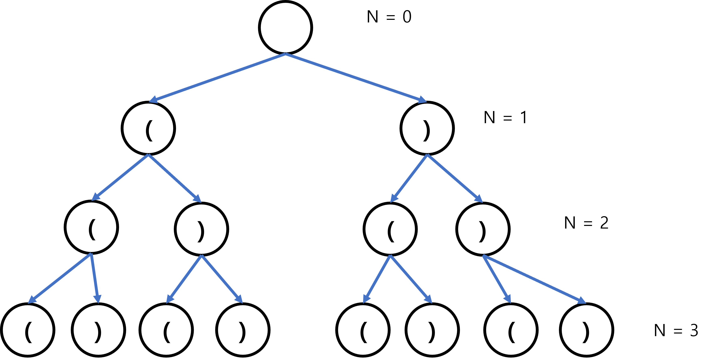
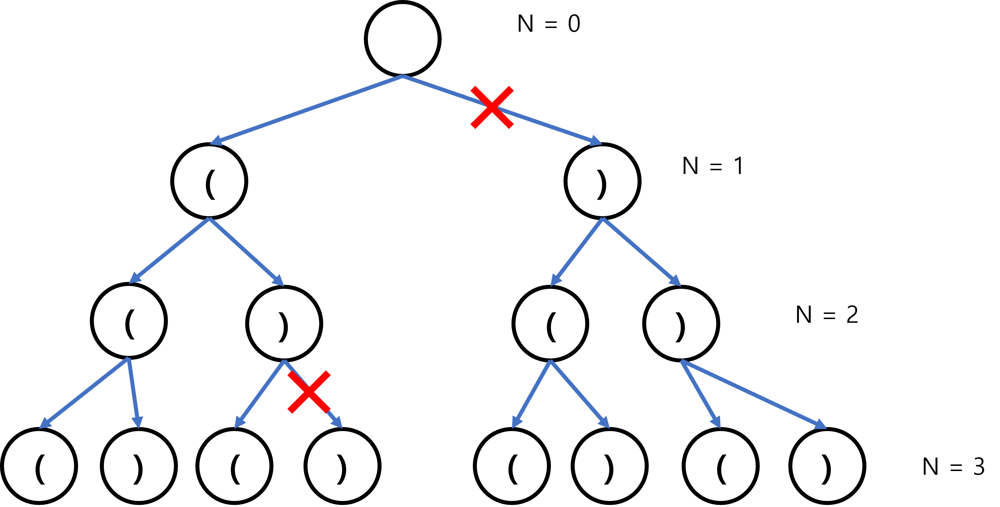
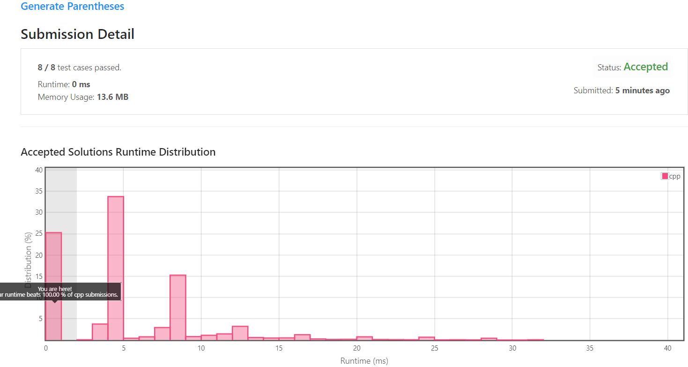

[[[
title : LeetCode - 22. Generate Parentheses
date : 2021-12-07 16:25:05
series : "LeetCode"
tags : ["Leet Code", "medium", "c++"]
]]]

## LeetCode - 22. Generate Parentheses
문제 - [LeetCode - 22. Generate Parentheses](https://leetcode.com/problems/generate-parentheses/)

## 문제 설명
정수 n이 주어지면 n개의 괄호로 이루어지는 모든 조합을 반환해야합니다.

예를 들어 n = 1이라면 `["()"]`이며, 

n = 2이라면 `["(())", "()()"]`, 

그리고 n = 3이라면 `["((()))","(()())","(())()","()(())","()()()"]`를 반환해야 합니다.

난이도는 `MEDIUM` 난이도 입니다.

## 풀이
[My Solutions(Github)](https://github.com/LDobac/leetcode/tree/master/22.%20Generate%20Parentheses)

### Solution 1 - Brute force

첫 번째 풀이 방법은 Brute force(무차별 대입)입니다. Brute force 방법은 풀이가 간단하기 때문에 한 번 시간 복잡도 Big-O만 계산하고 넘어가겠습니다.

먼저 n = 3인 경우에 대해서 모든 조합에 대한 트리를 구성해보겠습니다.



조합이 열린 괄호, 닫힌 괄호 두 가지이기 때문에 완전 이진 트리가 형성되었습니다. 단순히 Brute force를 한다면 트리를 탐색하면서 생기는 모든 조합이 탐색될 것입니다.

그렇다면 완전 이진 트리의 노드 수만큼의 순회가 발생하게 됩니다. 완전 [이진 트리는 2^h-1개의 노드](https://ko.wikipedia.org/wiki/%EC%9D%B4%EC%A7%84_%ED%8A%B8%EB%A6%AC)를 가질 수 있습니다.(여기서 h는 트리의 높이)

그러므로 n=3일때 트리의 높이는 h=4이므로 최소 O(2^n)으로 볼 수 있을 것 같습니다. 추가로 적절하지 않은 괄호의 형태도 모두 순회하니 이를 검사하는 시간 복잡도도 추가되어야 합니다.

### Solution 2 - Backtracking
이제 Backtracking 기법을 사용하여 Brute force 방법에서 적절한 괄호 쌍이 형성되지 않는 경로로는 탐색하지 않도록 하여 최적화를 시도해보겠습니다.

별도의 `open`, `close`변수를 선언합니다. `open` 변수는 현재 열린 괄호의 수, `close`변수는 닫힌 괄호의 수를 나타냅니다.

정상적으로 열리고 닫힌 괄호쌍이 형성될때는 항상 열린 괄호가 먼저 등장하고, 닫힌 괄호가 나중에 등장해야 합니다. 

그리고 본 문제에서는 괄호의 수인 n이라는 값이 주어지므로, 열린 괄호의 수가 n개를 넘어서는 안됩니다. n개를 넘어서는 순간, n개 이상의 괄호가 형성되기 때문입니다.



이런식으로 현재 열린 괄호의 수보다 닫힌 괄호의 수가 커지는 경우에 대해서는 탐색하지 않고 다시 돌아갑니다.

또한 열린 괄호의 수가 n보다 커지는 경우도 모두 제외합니다.

코드로 이를 구현해보겠습니다.

```c++
void generate(int n, int open, int close, string s, vector<string>& out) {...}
```

Backtracking으로 구현하기 위해 별도의 재귀함수를 선언합니다. 당연하지만, 일반적인 순회문으로도 충분히 구현 가능합니다.

open, close 변수는 위에서 설명되었으며, n는 괄호의 수, s는 현재까지 탐색된 괄호의 조합 문자열, out은 조합된 괄호의 출력입니다.

```c++
if (open < n)
{
    generate(n, open + 1, close, s + '(', out);
}
```

만약 열린 괄호의 수가 최대 괄호 개수보다 적다면 새로운 괄호를 열고 탐색을 계속합니다.

```c++
if (close < open)
{
    generate(n, open, close + 1, s + ')', out);
}
```
현재 닫힌 괄호의 수가 열린 괄호의 수보다 적다면 괄호를 하나 닫고 계속 탐색합니다.

```c++
if (s.length() == n * 2)
{
    out.push_back(s);
}
```

지금까지 조합된 괄호 문자열의 길이가 n*2라면 출력 배열에 삽입합니다. n * 2인 이유는 간단합니다. 입력 n은 괄호 쌍의 개수를 나타냅니다. 하나의 괄호쌍은 2개이기 때문에 만약 문자열의 길이가 n * 2이라면 n개의 괄호쌍이 모두 조합된거니 출력 배열에 삽입하면 됩니다.

이렇게 구현이 끝났습니다. 실질적인 구현 코드는 10줄 가량이 채 되지 않습니다. 

항상 생각하지만, 생각은 몇십분 이상을 해도 구현 코드는 몇 줄이 되지 않을때마다 조금 현타가 오는 기분이기도 하고 뿌듯하기도 합니다.

#### 제출 결과


제출 표본이 적기때문에 100%는 큰 의미가 없지만, 실행 속도가 0ms가 나오게 되었기 때문에 충분히 좋은 알고리즘이 구현된 것 같습니다.

<details>
<summary>코드 전문</summary>

```c++
class Solution {
public:
    vector<string> generateParenthesis(int n) {
        vector<string> result;

        generate(n, 0, 0, "", result);

        return result;
    }

    void generate(int n, int open, int close, string s, vector<string>& out)
    {
        if (s.length() == n * 2)
        {
            out.push_back(s);
        }

        if (open < n)
        {
            generate(n, open + 1, close, s + '(', out);
        }

        if (close < open)
        {
            generate(n, open, close + 1, s + ')', out);
        }
    }
};
```

</details>
