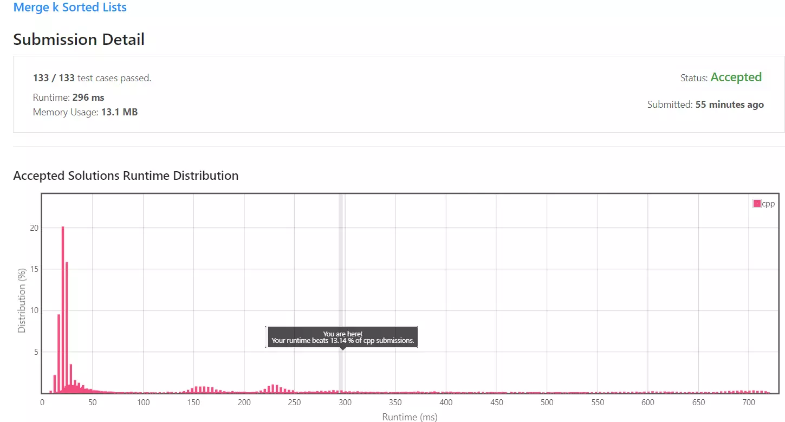
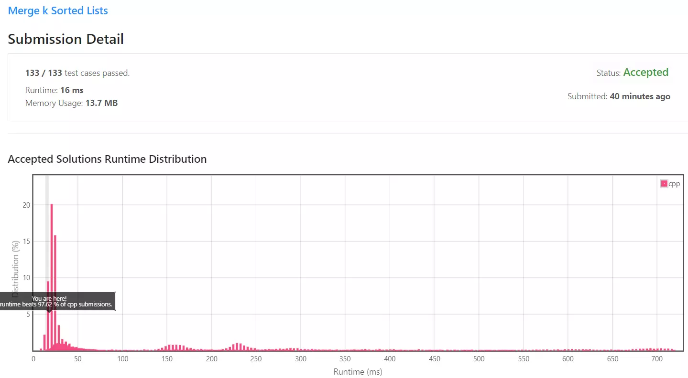
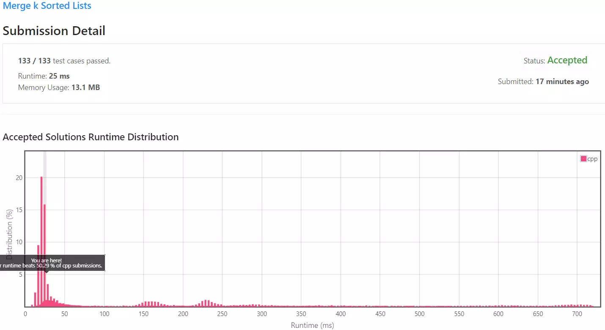

[[[
title : LeetCode - 23. Merge k Sorted Lists
date : 2021-12-08 11:09:23
series : "LeetCode"
tags : ["Leet Code", "hard", "c++"]
]]]

## LeetCode - 23. Merge k Sorted Lists
문제 - [LeetCode - 23. Merge k Sorted Lists](https://leetcode.com/problems/merge-k-sorted-lists/)

## 문제 설명
지난 [LeetCode - 21. Merge Two Sorted Lists](https://jaehee.dev/#/post/22) 문제의 확장 버전입니다.

정렬된 k개의 연결 리스트가 입력되면 모든 연결 리스트를 정렬된 하나의 연결리스트 반환합니다.

난이도는 `HARD` 난이도 입니다.

## 풀이
[My Solutions(Github)](https://github.com/LDobac/leetcode/tree/master/23.%20Merge%20k%20Sorted%20Lists)

### Solution 1 - Merge one by one
첫 번째 해결 방법은 [LeetCode - 21. Merge Two Sorted Lists](https://jaehee.dev/#/post/22)의 풀이 방법을 그대로 사용하여 풀어보겠습니다.

```c++
ListNode* mergeKLists(vector<ListNode*>& lists) {
    if (lists.size() == 0) return nullptr;

    ListNode* result = lists[0];

    for (size_t i = 1; i < lists.size(); i++)
    {
        result = mergeTwoLists(result, lists[i]);
    }

    return result;
}
```

단순히 두 연결 리스트를 병합하는 함수를 이용하여 하나하나씩 병합하여 k - 1번 순회하여 모든 연결 리스트를 연결합니다.

#### 제출 결과


실행 속도는 296ms, 다른 C++ 제출자에 비해서 13% 정도의 성능밖에 나오지 않았습니다. 이에 대한 이유를 알기 위해 Big-O를 계산해보겠습니다.

각 연결리스트를 하나하나씩 더하기 때문에 `lists = {list_1, list_2, list_3 ... ,list_k}`가 있을 때, 각 리스트의 노드수의 평균을 n개라고 해보겠습니다.

그럼 처음 `merge(list_1, list_2)`를 수행할 때 O(n)의 시간 복잡도가 발생합니다(길이가 n인 리스트를 순회하므로). 그리고 반환된 리스트의 길이는 2n이 되겠죠. 이 리스트를 `list_1m2`라고 해보겠습니다.

그리고 `list_1m2`와 `list_3`에 대해서 `merge(list_1m2, list_3)`를 수행하면 O(2n)의 시간 복잡도가 발생합니다(길이가 2n, n인 리스트를 순회하므로 최악의 경우인 2n). 그럼 반환된 리스트 `list_1m3`은 길이가 3n이 됩니다.

이런식으로 k번째까지 쭉 더하면 발생하는 반복 횟수는 `n + 2n + 3n + ... + kn = n(1 + 2 + 3 + ... + k)`가 됩니다.

일반적으로 `1 + 2 + 3 + ... + k = k(k + 1)/2`로 계산할 수 있으니, `nk(k+1)/2`입니다. 따라서 O(kn^2)이 되게됩니다.

공간 복잡도는 입력 리스트에 관계 없이 하나의 포인터만 선언하므로 O(1)입니다.

<details>
<summary>코드 전문</summary>

```c++
class Solution {
public:
    ListNode* mergeKLists(vector<ListNode*>& lists) {
        if (lists.size() == 0) return nullptr;

        ListNode* result = lists[0];

        for (size_t i = 1; i < lists.size(); i++)
        {
            result = mergeTwoLists(result, lists[i]);
        }

        return result;
    }

    ListNode* mergeTwoLists(ListNode* list1, ListNode* list2) {
        if (!list1 && !list2) return nullptr;
        
        ListNode* mergedHead = nullptr;
        ListNode* lastNode = nullptr;

        ListNode* node1 = list1;
        ListNode* node2 = list2;

        while (node1 && node2)
        {
            ListNode* selectedNode = nullptr;

            if (node1->val < node2->val)
            {
                selectedNode = node1;
                node1 = node1->next;
            }
            else
            {
                selectedNode = node2;
                node2 = node2->next;
            }

            if (mergedHead == nullptr)
            {
                mergedHead = selectedNode;
            }
            else
            {
                lastNode->next = selectedNode;
            }

            lastNode = selectedNode;
        }

        if (node1)
        {
            if (!mergedHead)
            {
                mergedHead = node1;
            }
            else
            {
                for (auto node = node1; node != nullptr; node = node->next)
                {
                    lastNode->next = node;
                    lastNode = node;
                }
            }
        }

        if (node2)
        {
            if (!mergedHead)
            {
                mergedHead = node2;
            }
            else
            {
                for (auto node = node2; node != nullptr; node = node->next)
                {
                    lastNode->next = node;
                    lastNode = node;
                }
            }
        }

        return mergedHead;   
    }
};
```

</details>

### Solution 2 - Prority Queue
두 번째 풀이 방법은 우선 순위 큐, 혹은 Heap 자료 구조를 이용해 풀어보도록 하겠습니다.

우선 순위 큐(Heap)은 일반적으로 최대 혹은 최소 값을 빠르게 찾기 위해 사용되는 자료구조입니다.

현재 문제는 오름차순으로 정렬된 모든 리스트를 하나의 정렬된 리스트로 반환하는 문제이기 때문에 입력으로 주어진 모든 노드를 우선 순위 큐에 삽입하고 빼면서 하나의 리스트로 만든다면 문제를 해결할 수 있을것입니다.

풀이에 사용되는 언어가 C++이므로 C++ STL의 [priority_queue](https://en.cppreference.com/w/cpp/container/priority_queue) 자료구조를 사용하도록 합니다. 해당 자료구조에 대한 자세한 스펙은 연결된 링크를 참조해주세요.

```c++
auto cmp = [](ListNode* left, ListNode* right) {
    return left->val > right->val;
};

priority_queue<ListNode*, vector<ListNode*>, decltype(cmp)> queue(cmp);
```

우선 순위 큐를 선언하고 별도의 비교 함수를 전달하여 해당 우선 순위 큐가 오름차순(min-heap)으로 형성되도록 합니다.

```c++
for (auto &&head : lists)
{
    for (auto node = head; node != nullptr; node = node->next)
    {
        queue.push(node);
    }
}
```

그리고 입력된 모든 노드를 큐에 삽입합니다.

```c++
while (!queue.empty()) 
{
    auto r = queue.top(); 
    queue.pop();

    if (!head) 
    {
        head = r;
        tail = head;
        continue;
    }

    tail->next = r;
    r->next = nullptr;
    tail = r;
}
```

그리고 단순히 큐에서 하나씩 pop을 수행하면서 하나의 연결 리스트로 형성합니다.

#### 제출 결과


실행 속도는 16ms, 97% 가량의 성능이 도출되었습니다. 

우선 순위 큐에 경우 구현 방법에 따라 시간 복잡도가 약간씩 다르지만 보통 삽입은 O(1), 삭제는 O(logn)으로 도출됩니다. 따라서 k개의 리스트에 대해 삽입과 삭제를 하므로 O(klogn)로 계산할 수 있습니다.

다만, 공간 복잡도는 k개의 우선 순위 큐 공간이 필요하므로 O(k)가 되게됩니다.

<details>
<summary>코드 전문</summary>

```c++
class Solution {
public:
    ListNode* mergeKLists(vector<ListNode*>& lists) {
        if (lists.size() == 0) return nullptr;

        ListNode* head = nullptr;
        ListNode* tail = nullptr;

        auto cmp = [](ListNode* left, ListNode* right) {
            return left->val > right->val;
        };

        priority_queue<ListNode*, vector<ListNode*>, decltype(cmp)> queue(cmp);

        for (auto &&head : lists)
        {
            for (auto node = head; node != nullptr; node = node->next)
            {
                queue.push(node);
            }
        }

        while (!queue.empty()) 
        {
            auto r = queue.top(); 
            queue.pop();

            if (!head) 
            {
                head = r;
                tail = head;
                continue;
            }

            tail->next = r;
            r->next = nullptr;
            tail = r;
        }

        return head;
    }
};
```

</details>

### Solution 3 - Divide and Conquer
세 번째 방법은 분할 정복을 이용하여 성능은 최대한 유지하면서 공간 복잡도는 O(1)로 구현해보도록 하겠습니다.

구현 자체는 간단합니다. Solution 1과 동일하게 두 연결 리스트를 병합하는 함수를 이용합니다. 하지만, 병합하는 과정에서 분할 정복 기법을 이용하게 됩니다.

```c++
auto amount = lists.size();
auto interval = 1;
while (interval < amount)
{
    for (auto i = 0; i < amount - interval; i += interval * 2)
    {
        lists[i] = mergeTwoLists(lists[i], lists[i + interval]);
    }
    interval *= 2;
}
```

#### 제출 결과

실행 속도는 25ms로 Solution 2와 큰 차이가 없음을 확인할 수 있습니다. 

공간 복잡도도 O(1)이기 때문에 시간 복잡도와 공간 복잡도를 아주 적절하게 Trade-off 한것입니다.

평균 노드 개수가 n인 k개의 연결 리스트를 분할 정복 기법으로 병합하는 경우의 Big-O를 계산해보겠습니다.

*출처 : https://m.blog.naver.com/PostView.naver?isHttpsRedirect=true&blogId=kks227&logNo=220776241154*


분할 정복은 문제를 일반적으로 m개씩 분해합니다(여기서는 2개씩 분해합니다). 

이때 우리의 코드는 k개의 연결 리스트를 2개씩 분할해서 병합합니다. 최대로 분할 될 수 있는 단계는 logk(밑이 2인데 생략)이므로 분할의 시간 복잡도는 O(logk)입니다.

이때 k개가 있으므로 O(klogk)로 계산할 수 있습니다. 그리고 n개의 노드를 병합해야 하므로 O(n * klogk)의 시간 복잡도가 계산됩니다.

Solution 1의 시간 복잡도는 `O(kn^2)`이였는데 Solution 3의 시간 복잡도는 `O(n * klogk)`이므로 당연히 더 빠르게 실행됩니다.

실제로 손으로 하나씩 계산해보더라도 Solution 1의 순회의 경우 n + 2n + 3n + ...으로 병합한 두 연결 리스트의 결과인 2n에 대해서 또 병합을 하니 위와 같은 결과가 나오게 됩니다.

하지만 Solution 3의 경우 (n + n), (n + n)... (2n + 2n), (2n + 2n)... (4n + 4n), ... 과 같이 분할된게 합쳐지면서 병합되기 때문에 최악의 경우가 nlogn밖에 되지 않습니다.


<details>
<summary>코드 전문</summary>

```c++
class Solution {
public:
    ListNode* mergeKLists(vector<ListNode*>& lists) {
        if (lists.size() == 0) return nullptr;

        auto amount = lists.size();
        auto interval = 1;
        while (interval < amount)
        {
            for (auto i = 0; i < amount - interval; i += interval * 2)
            {
                lists[i] = mergeTwoLists(lists[i], lists[i + interval]);
            }
            interval *= 2;
        }

        return lists[0];
    }

    ListNode* mergeTwoLists(ListNode* list1, ListNode* list2) {
        if (!list1 && !list2) return nullptr;
        
        ListNode* mergedHead = nullptr;
        ListNode* lastNode = nullptr;

        ListNode* node1 = list1;
        ListNode* node2 = list2;

        while (node1 && node2)
        {
            ListNode* selectedNode = nullptr;

            if (node1->val < node2->val)
            {
                selectedNode = node1;
                node1 = node1->next;
            }
            else
            {
                selectedNode = node2;
                node2 = node2->next;
            }

            if (mergedHead == nullptr)
            {
                mergedHead = selectedNode;
            }
            else
            {
                lastNode->next = selectedNode;
            }

            lastNode = selectedNode;
        }

        if (node1)
        {
            if (!mergedHead)
            {
                mergedHead = node1;
            }
            else
            {
                for (auto node = node1; node != nullptr; node = node->next)
                {
                    lastNode->next = node;
                    lastNode = node;
                }
            }
        }

        if (node2)
        {
            if (!mergedHead)
            {
                mergedHead = node2;
            }
            else
            {
                for (auto node = node2; node != nullptr; node = node->next)
                {
                    lastNode->next = node;
                    lastNode = node;
                }
            }
        }

        return mergedHead;   
    }
};
```

</details>
