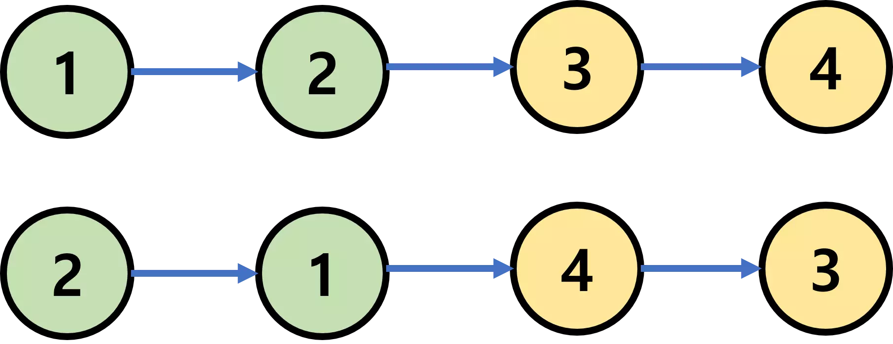
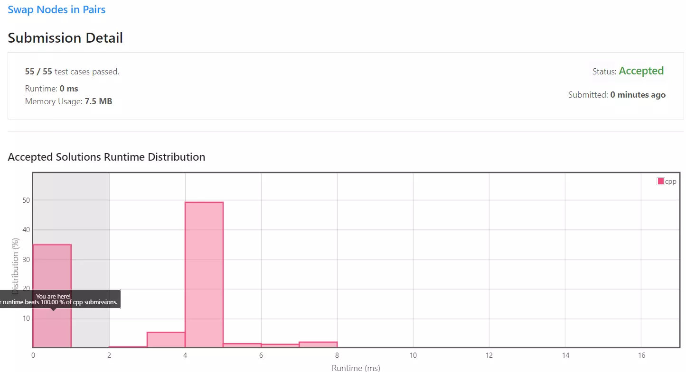

[[[
title : LeetCode - 24. Swap Nodes in Pairs
date : 2021-12-09 22:26:34
series : "LeetCode"
tags : ["Leet Code", "medium", "c++"]
]]]

## LeetCode - 24. Swap Nodes in Pairs
문제 - [LeetCode - 24. Swap Nodes in Pairs](https://leetcode.com/problems/swap-nodes-in-pairs/)

## 문제 설명
연결 리스트가 주어지면 근접한 한 노드와 짝을 지어 두 노드를 swap 합니다. 이때 노드의 값을 변경하는 것은 허락되지 않고 오직 노드의 next 포인터만 수정가능합니다.



위 이미지와 같이 한 쌍의 노드를 swap합니다.

난이도는 `MEDIUM` 난이도 입니다.

## 풀이
[My Solutions(Github)](https://github.com/LDobac/leetcode/tree/master/14.%20Longest%20Common%20Prefix)

### Solution

사실 난이도가 medium으로 측정되어 있지만, 단순히 두 연결 리스트의 next 포인터를 swap만 하면 되는 문제입니다.

일반적으로 맨 처음 컴퓨터 언어에 대한 tutorial에서 두 변수를 swap하는 예제와 상당히 유사합니다.

다만 차이점이라면 순방향 연결 리스트이기 때문에 약간의 처리가 필요합니다.

```c++
while (left && right)
{
    // 일반적인 변수 swap 코드
    ListNode* tmp = right->next;

    right->next = left;
    left->next = tmp;

    // 현재 swap하는 노드의 previous 노드의 next를 연결한다.
    if (prev) prev->next = right;
    prev = left;

    // 첫 순회면 head 포인터를 업데이트한다.
    if (head == left) head = right;

    // left, right 포인터를 다음 swap할 포인터로 옮긴다.
    left = tmp;
    if (tmp) right = tmp->next;
}
```

실질적인 실행 코드는 단 10줄 가량으로 정리됩니다. 추가적인 설명은 하지 않도록 하겠습니다.

#### 제출 결과


난이도가 medium으로 측정된것과 다르게 사실상 easy 난이도나 다름 없었습니다.

종종 느끼지만 leetcode에서 측정하는 난이도는 상당히 이상하다고 느껴지는 점이 종종 있는 것 같습니다.

<details>
<summary>코드 전문</summary>

```c++
class Solution {
public:
    ListNode* swapPairs(ListNode* head) 
    {
        if (!head) return nullptr;

        ListNode* prev = nullptr;
        ListNode* left = head;
        ListNode* right = head->next;

        while (left && right)
        {
            ListNode* tmp = right->next;

            right->next = left;
            left->next = tmp;

            if (prev) prev->next = right;
            prev = left;

            if (head == left) head = right;
            
            left = tmp;
            if (tmp) right = tmp->next;
        }
        
        return head;
    }
};
```

</details>
